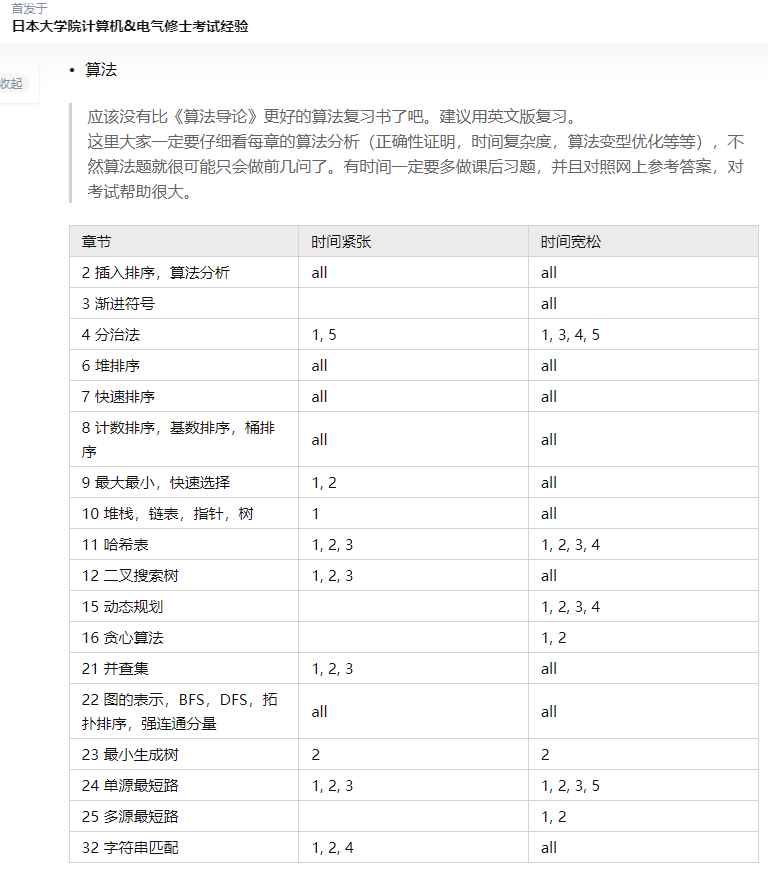
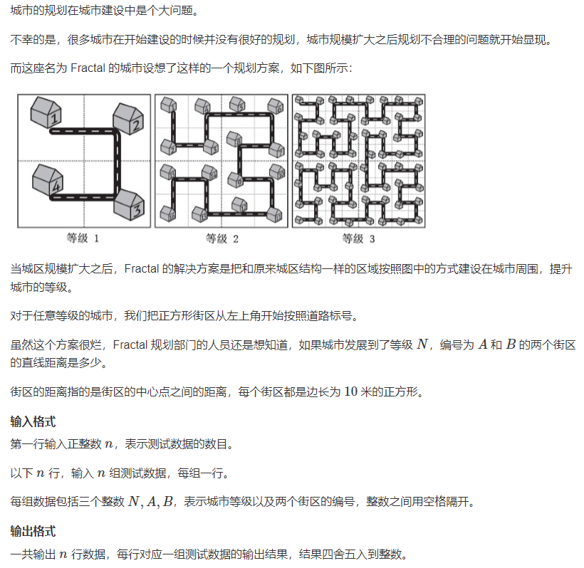
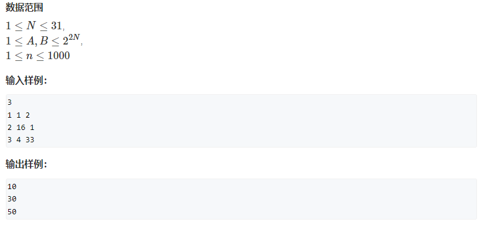
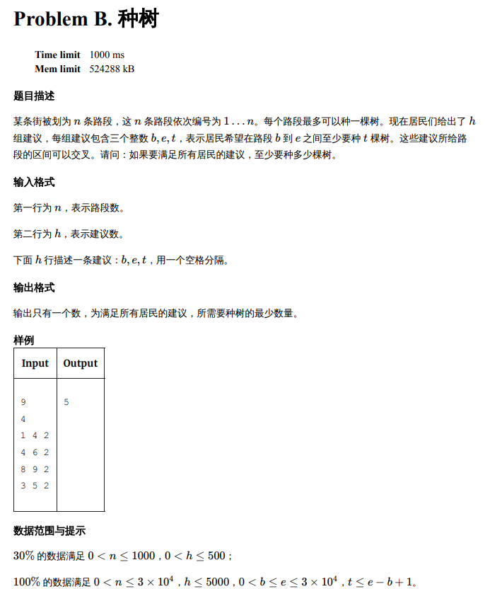
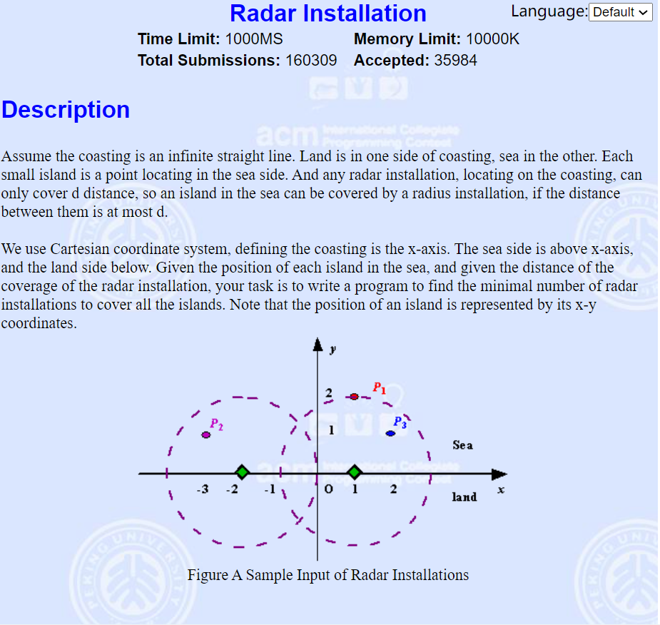
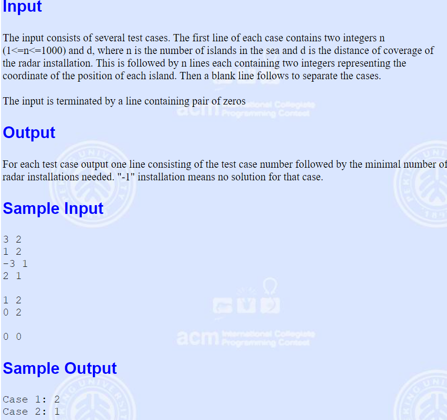
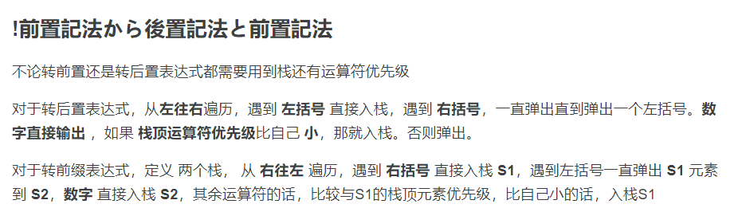
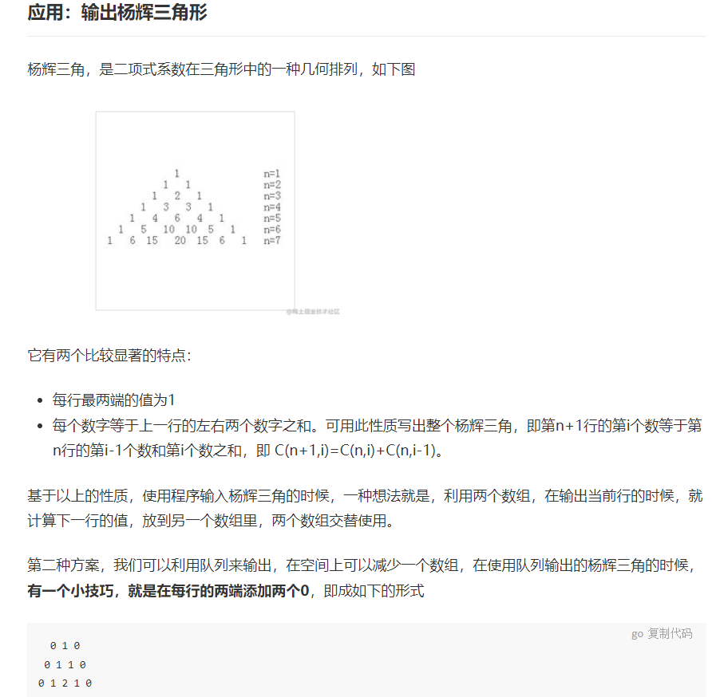

# Algorithm Rehabilitation Program


## ***Contents***

[TOC]


## **Outline**

---



---

## **Day 1**

---

### Purple Book - City of Fractal

- Key

> Recursion (Fractal)
>
> Coordinate Transformation (Self-similarity)





```c++
#include <iostream>
#include <cmath>
using namespace std;

typedef long long LL;
typedef pair<LL, LL> PLL;

int n;

PLL calc(int n, LL m)
{
    if (!n) return {0, 0};	//new feature in C++11, Assign to a struct
    LL len = 1LL << n - 1, cnt = 1LL << 2*n - 2;  //1LL Forced type convertion, incase overflow when '<<'
    auto pos = calc(n - 1, m % cnt);       // ?
    auto x = pos.first, y = pos.second;
    auto z = m / cnt;                      // ?
    switch(z){
        case 0 : return {y, x};
        case 1 : return {x, y + len};
        case 2 : return {x + len, y + len};
        default : return{- y + len * 2 - 1, - x + len - 1};
    }

}

int main()
{
    cin >> n;
    while (n -- ){
        
        LL N, A, B;
        cin >> N >> A >> B;
        auto ac = calc(N, A - 1);
        auto bc = calc(N, B - 1);
        auto x = abs(ac.first - bc.first);
        auto y = abs(ac.second - bc.second);
        printf("%.0lf\n", sqrt(x*x + y*y) * 10);
        
    }
    return 0;
}
```

---

### UVA - 12171 Sculpture

- Key

> Discretization
>
> Flood Fill

```c++

```

---

[Back to Top](#contents)


## **Greedy Idea**

---

### Purple Book - Missile Defense System

- Key

>Greedy
>
>迭代加深 （apply BFS via DFS - via Set a Limit Depth）
>
>semi DP

```c++

```

---

### FJNU - Preliminary 2005 Cross the Desert

- Key

>Greedy
>
>semi DP

```

```

---

### LibreOJ - 10001 Planting Trees

- Key

>Greedy
>
>Interval coverage



```c++
#include <bits/stdc++.h>	//no need to using namespace ?
using namespace std;

struct line{int b, e, t;}a[5005], mid;
int lu[30005] = {0};

bool cmp(const line &x, const line &y){
    return x.e < y.e;
}

int main(){
    int n, h;
    cin >> n >> h;
    for(int i = 1; i <=h; i ++){             //
        cin >> a[i].b >> a[i].e >> a[i].t;
    }
    sort(a + 1, a + h + 1, cmp);
    
    int k = 0;
    for(int i = 1; i <= h; i ++){
        									//
        int d = 0;
        for(int j = a[i].e; j >= a[i].b; j --)
            if(lu[j] == 1) d++;
        if(d >= a[i].t) continue;                         //
        	else{										  //
                for(int q = q[i].e; q >= a[i].b; q --){
                    if(lu[q] != 1){
                        lu[q] = 1;
                        d++;
                        k++;
                        if(d == a[i].t) break;
                    }
                }
            }
    }
    cout << k << endl;
    return 0;
}
/////////////from dqjn///////////learn to formalize
```

```c++
#include <iostream>
#include <algorithm>
using namespace std;

struct {}a[5005], mid;
bool cmp(){}

int main(){}
```

---

### POJ - Radar Installation

- Key

>Greedy
>
>Interval coverage





```c++

```

---

[Back to Top](#contents)


## **リスト**

---

- 前插法、后插法
- 合并有序链表
  - 循环链表节省一个空间 - not imp - minor
- Loop Detect - Quick-Slow Pointers

---

[Back to Top](#contents)


## **スタック**

---

### 单调栈 - ？


---

### Mimic Queue via 2 Stack

```c++

```

---

### Expression

- **前置記法 - ポーランド記法 - Polish Notation**

- **後置記法 - 逆ポーランド記法 - RPN**




---

[Back to Top](#contents)


## **キユー**

---

### 循环队列

- 队尾留空

```c++

```

- 额外标志位

```c++

```

---

### Print 杨辉Triangle



```c++

```

---

### 舞伴问题

```c++

```

---

### 优先队列 - 加油问题

>priority queue (heap)
>
>greedy

```

```

---

### 单调队列 - 滑动窗口

>単調スタックと似ています。新たの要素がキューに入りたい時に、WHILE循環で、単調性を判別して，単調性を満足できるまで、要素をPOP

```

```

---

### 双端优先队列 - 实现

>1. 平衡二叉搜索树
>2. Min-Max Heap
>3. Pairing Heap

​	[Wiki - See More](https://zh.wikipedia.org/wiki/%E5%8F%8C%E7%AB%AF%E4%BC%98%E5%85%88%E9%98%9F%E5%88%97#%E5%AE%9E%E7%8E%B0)

- **Dual Structure Method**
- **Completely Correspond**
- **Leaf Node Correspond**

---

[Back to Top](#contents)


## **String**

---

### KMP

>KMP
>
>next[]计算
>
>Improve KMP

- KMP

```c++

```

- next

```c++

```

- 改进KMP

```c++

```

---

[Back to Top](#contents)


## **Sorting Algorithm**

---

### 多路归并排序


---

### Quick Sort

- **Quick Sort**

```c++

```

- **Partition**

```c++

```

- **Time Complexity Analyze**

$$
sorry
$$

---

### More Quick Sort


---

[Back to Top](#contents)


## **Techniques**

---

```c++
//Tip 01
struct line{int b, e, t;}a[5005], mid;
bool cmp(const line &x, const line &y){return x.e < y.e;}

//Tip 02
int lu[30005] = {0};
```

---
