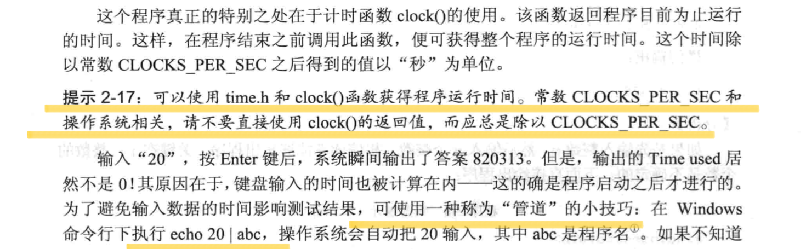
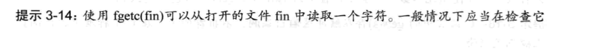

# Algorithm Rehabilitation Program


## ***Contents***
- [Algorithm Rehabilitation Program](#algorithm-rehabilitation-program)
  - [***Contents***](#contents)
  - [**Outline**](#outline)
  - [**Day 1**](#day-1)
    - [Purple Book - City of Fractal](#purple-book---city-of-fractal)
    - [UVA - 12171 Sculpture](#uva---12171-sculpture)
  - [**Greedy Idea**](#greedy-idea)
    - [Purple Book - Missile Defense System](#purple-book---missile-defense-system)
    - [FJNU - Preliminary 2005 Cross the Desert](#fjnu---preliminary-2005-cross-the-desert)
    - [区间贪心问题专题（区间选点，区间覆盖，区间选取）](#区间贪心问题专题区间选点区间覆盖区间选取)
    - [LibreOJ - 10001 Planting Trees](#libreoj---10001-planting-trees)
    - [POJ - Radar Installation](#poj---radar-installation)
  - [**リスト**](#リスト)
  - [**スタック**](#スタック)
    - [单调栈 - ？](#单调栈---)
    - [Mimic Queue via 2 Stack](#mimic-queue-via-2-stack)
    - [Expression](#expression)
  - [**キユー**](#キユー)
    - [Circled Queue](#circled-queue)
    - [Print 杨辉Triangle](#print-杨辉triangle)
    - [舞伴问题](#舞伴问题)
    - [優先度付きキュー - 加油问题](#優先度付きキュー---加油问题)
    - [单调队列 - Slide Window](#单调队列---slide-window)
    - [双端优先队列 - 实现](#双端优先队列---实现)
  - [**String**](#string)
    - [KMP](#kmp)
  - [**Tree**](#tree)
  - [**Sorting Algorithm**](#sorting-algorithm)
    - [Compare](#compare)
    - [多路归并排序](#多路归并排序)
    - [Quick Sort](#quick-sort)
    - [More Quick Sort](#more-quick-sort)
  - [**Graph Algorithm**](#graph-algorithm)
    - [Concepts](#concepts)
    - [图的存储](#图的存储)
  - [**Flow Networks**](#flow-networks)
    - [基本概念](#基本概念)
  - [**Techniques**](#techniques)
    - [多文件](#多文件)
    - [输入输出](#输入输出)
    - [递归栈 gdb](#递归栈-gdb)
    - [字符串 - 及I/O](#字符串---及io)
    - [结构体](#结构体)
    - [STL](#stl)
    - [G++](#g)

---


## **Outline**

---

- 参考書籍


> 
>
> 

> > 

---


## **Day 1**

---

### Purple Book - City of Fractal

- Key

> Recursion (Fractal)
>
> Coordinate Transformation (Self-similarity)


```c++
#include <iostream>
#include <cmath>
using namespace std;

typedef long long LL;
typedef pair<LL, LL> PLL;

int n;

PLL calc(int n, LL m)
{
    if (!n) return {0, 0};	//new feature in C++11, Assign to a struct
    LL len = 1LL << n - 1, cnt = 1LL << 2*n - 2;  //1LL Forced type convertion, incase overflow when '<<'
    auto pos = calc(n - 1, m % cnt);       // ?
    auto x = pos.first, y = pos.second;
    auto z = m / cnt;                      // ?
    switch(z){
        case 0 : return {y, x};
        case 1 : return {x, y + len};
        case 2 : return {x + len, y + len};
        default : return{- y + len * 2 - 1, - x + len - 1};
    }

}

int main()
{
    cin >> n;
    while (n -- ){
        
        LL N, A, B;
        cin >> N >> A >> B;
        auto ac = calc(N, A - 1);
        auto bc = calc(N, B - 1);
        auto x = abs(ac.first - bc.first);
        auto y = abs(ac.second - bc.second);
        printf("%.0lf\n", sqrt(x*x + y*y) * 10);
        
    }
    return 0;
}
```

---

### UVA - 12171 Sculpture

- Key

> Discretization
>
> Flood Fill

```c++

```

---

[Back to Top](#contents)


## **Greedy Idea**

---

### Purple Book - Missile Defense System

- Key

>Greedy
>
>迭代加深 （apply BFS via DFS - via Set a Limit Depth）
>
>semi DP

```c++

```

---

### FJNU - Preliminary 2005 Cross the Desert

- Key

>Greedy
>
>semi DP

```

```

---

### 区间贪心问题专题（区间选点，区间覆盖，区间选取）

[See More](https://www.cnblogs.com/dchnzlh/p/10427309.html)

---

### LibreOJ - 10001 Planting Trees

- Key

>Interval Greedy （区间选点）


```c++
#include <bits/stdc++.h>	//no need to using namespace ?
using namespace std;

struct line{int b, e, t;}a[5005], mid;
int lu[30005] = {0};

bool cmp(const line &x, const line &y){
    return x.e < y.e;
}

int main(){
    int n, h;
    cin >> n >> h;
    for(int i = 1; i <=h; i ++){             //
        cin >> a[i].b >> a[i].e >> a[i].t;
    }
    sort(a + 1, a + h + 1, cmp);
    
    int k = 0;
    for(int i = 1; i <= h; i ++){
        									//
        int d = 0;
        for(int j = a[i].e; j >= a[i].b; j --)
            if(lu[j] == 1) d++;
        if(d >= a[i].t) continue;                         //
        	else{										  //
                for(int q = a[i].e; q >= a[i].b; q --){
                    if(lu[q] != 1){
                        lu[q] = 1;
                        d++;
                        k++;
                        if(d == a[i].t) break;
                    }
                }
            }
    }
    cout << k << endl;
    return 0;
}
/////////////from dqjn///////////learn to formalize
```

```java
 1 import java.util.Arrays;
 2 import java.util.Scanner;
 3 
 4 public class 区间选点问题1 {
 5     public static void main(String[] args) {
 6         Scanner sc = new Scanner(System.in);
 7         int n = sc.nextInt();
 8         Interval[] intervals = new Interval[n];
 9         for (int i = 0; i < n; i++) {
10             intervals[i] = new Interval(sc.nextInt(), sc.nextInt(), sc.nextInt());
11         }
12         Arrays.sort(intervals);// 按区间右端点排序
13 
14         int max = intervals[n - 1].t;// 右端最大值
15         int[] axis = new int[max + 1];// 标记数轴上的点是否已经被选中
16         // int[] sums = new int[max + 1];
17         for (int i = 0; i < n; i++) {
18             // 1.查阅区间中有多少个点
19             int s = intervals[i].s;// 起点
20             int t = intervals[i].t;// 终点
21             int cnt = sum(axis, s, t);// 找到这个区间已经选点的数量，
22                                         //sums[t] - sums[s - 1]; 效率低
23             // 2.如果不够，从区间右端开始标记，遇标记过的就跳过
24             intervals[i].c -= cnt;// 需要新增的点的数量
25             while (intervals[i].c > 0) {
26                 if (axis[t] == 0) {// 从区间终点开始选点
27                     axis[t] = 1;
28                     // updateSums(t,sums);//更新前缀和
29                     intervals[i].c--;// 进一步减少需要新增的点的数量
30                     t--;
31                 } else {// 这个点已经被选过了
32                     t--;
33                 }
34             }
35 
36         }
37         System.out.println(sum(axis, 0, max));
38     }
39 
40     /**
41      * 统计数轴axis上s-t区间已经有多少个点被选中
42      * 
43      * @param axis
44      * @param s
45      * @param t
46      * @return
47      */
48     private static int sum(int[] axis, int s, int t) {
49         int sum = 0;
50         for (int i = s; i <= t; i++) {
51             sum += axis[i];
52         }
53         return sum;
54     }
55 
56     private static void updateSums(int t, int[] sums) {
57         for (int i = t; i < sums.length; i++) {
58             sums[i]++;
59         }
60     }
61 
62     private static class Interval implements Comparable<Interval> {
63         int s;
64         int t;
65         int c;
66 
67         public Interval(int s, int t, int c) {
68             this.s = s;
69             this.t = t;
70             this.c = c;
71         }
72 
73         @Override
74         public int compareTo(Interval other) {
75             int x = this.t - other.t;
76             if (x == 0)
77                 return this.s - other.s;
78             else
79                 return x;
80         }
81     }
82 }
```

```c++
//树状数组，降低扫描区间的时间复杂度
#include <bits/stdc++.h>
using namespace std;

#define N 30005
#define M 5005

struct node {
    int L, R, t;
} A[M];
int n, m, ans = 0;
int C[N];
bool mark[N];

bool cmp(node a, node b) {
    if (a.R != b.R)
        return a.R < b.R;

    return a.L < b.L;
}
void Add(int x, int a) {
    while (x <= n) {
        C[x] += a;
        x += x & (-x);
    }
}
int Sum(int x) {
    int res = 0;

    while (x > 0) {
        res += C[x];
        x -= x & -x;
    }

    return res;
}

int main() {
    scanf("%d%d", &n, &m);

    for (int i = 1; i <= m; i++) {
        scanf("%d%d%d", &A[i].L, &A[i].R, &A[i].t);
    }

    sort(A + 1, A + 1 + m, cmp);
    memset(mark, false, sizeof mark);

    for (int i = 1; i <= m; i++) {
        int tmp = Sum(A[i].R) - Sum(A[i].L - 1);

        if (A[i].t <= tmp)
            continue;

        A[i].t -= tmp;
        ans += A[i].t;

        for (int j = A[i].R; j >= A[i].L && A[i].t > 0; j--) {
            if (!mark[j]) {
                mark[j] = true;
                Add(j, 1);
                A[i].t--;
            }
        }
    }

    printf("%d\n", ans);
    return 0;
}
```

```java
 1 import java.util.Arrays;
 2 import java.util.Scanner;
 3 
 4 public class 区间选点问题2 {
 5     public static void main(String[] args) {
 6         Scanner sc = new Scanner(System.in);
 7         int n = sc.nextInt();
 8         Interval[] intervals = new Interval[n];
 9         for (int i = 0; i < n; i++) {
10             intervals[i] = new Interval(sc.nextInt(), sc.nextInt(), sc.nextInt());
11         }
12         Arrays.sort(intervals);// 按区间右端点排序
13 
14         int max = intervals[n - 1].t;// 右端最大值
15         int[] axis = new int[max + 1];
16         int[] c = new int[max + 2];
17         // int[] sums = new int[max + 1];
18         for (int i = 0; i < n; i++) {
19             // 1.查阅区间中有多少个点
20             int s = intervals[i].s;// 起点
21             int t = intervals[i].t;// 终点
22             int cnt = sum(t + 1, c, max + 1) - sum(s, c, max + 1);// sum(axis,s,t);//sums[t]
23                                                                     // - sums[s
24                                                                     // -
25                                                                     // 1];//效率低
26             // 2.如果不够，从区间右端开始标记，遇标记过的就跳过
27             intervals[i].c -= cnt;
28             while (intervals[i].c > 0) {
29                 if (axis[t] == 0) {
30                     axis[t] = 1;
31                     update(t + 1, 1, c, max + 1);
32                     intervals[i].c--;
33                     t--;
34                 } else {
35                     t--;
36                 }
37             }
38 
39         }
40         System.out.println(sum(max + 2, c, max + 1));
41     }
42 
43     /**
44      * 更新树状数组c，注意i是项数，不是下标，而是下标+1
45      */
46     private static void update(int i, int delta, int[] c, int n) {
47         for (; i <= n; i += lowbit(i)) {
48             c[i] += delta;
49         }
50     }
51 
52     /**
53      * 前i项和，注意：i不是下标
54      * 
55      * @param i
56      * @return
57      */
58     private static int sum(int i, int[] c, int n) {
59         int sum = 0;
60         if (i > n)
61             i = n;
62         for (; i > 0; i -= lowbit(i)) {
63             sum += c[i];
64         }
65         return sum;
66     }
67 
68     /**
69      * 它通过公式来得出k，其中k就是该值从末尾开始1的位置。 然后将其得出的结果加上x自身就可以得出当前节点的父亲节点的位置
70      * 或者是x减去其结果就可以得出上一个父亲节点的位置。
71      * 比如当前是6，二进制就是0110，k为2，那么6+2=8，C(8)则是C(6)的父亲节点的位置；
72      * 相反，6-2=4，则是C(6)的上一个父亲节点的位置。
73      */
74     static int lowbit(int x) {
75         return x - (x & (x - 1));
76     }
77 
78     private static class Interval implements Comparable<Interval> {
79         int s;
80         int t;
81         int c;
82 
83         public Interval(int s, int t, int c) {
84             this.s = s;
85             this.t = t;
86             this.c = c;
87         }
88 
89         @Override
90         public int compareTo(Interval other) {
91             int x = this.t - other.t;
92             if (x == 0)
93                 return this.s - other.s;
94             else
95                 return x;
96         }
97     }
98 }
```

[OI Wiki - 树状数组](https://oi-wiki.org/ds/fenwick)

---

### POJ - Radar Installation

- Key

>Interval Greedy （区间选点）


```c++

```

---

[Back to Top](#contents)


## **リスト**

---

- 前插法、后插法
- 合并有序链表
  - 循环链表节省一个空间 - not imp - minor
- Loop Detect - Quick-Slow Pointers

---

[Back to Top](#contents)


## **スタック**

---

### 单调栈 - ？


---

### Mimic Queue via 2 Stack

```c++

```

---

### Expression

- 前置記法 - ポーランド記法 - Polish Notation

- 後置記法 - 逆ポーランド記法 - RPN

- **Key** - **中缀转后缀** (前缀)


- **后缀求值**


- **中缀直接求值**

```c++
#include <iostream>
#include <cstring>
#include <stack>
#include <unordered_map>
#include <algorithm>

using namespace std;

stack<int> num;
stack<char> opt;

unordered_map<char, int> pr {{'+', 1}, {'-', 1}, {'*', 2}, {'/', 2}};

string exp;

void eval()
{
    auto b = num.top(); num.pop();
    auto a = num.top(); num.pop();
    auto op = opt.top(); opt.pop();

    int x;
    if (op == '+') x = a + b;
    else if (op == '-') x = a - b;
    else if (op == '*') x = a * b;
    else x = a / b;

    num.push(x);
}

int main()
{
    cin >> exp;
    int len = exp.size();

    for (int i = 0; i < len; i ++){
        auto c = exp[i];

        if (isdigit(c)) {
            int x = 0;
            while (i < len && isdigit(exp[i]))
                x = x * 10 + exp[i ++] - '0';
            num.push(x);
            i --;
        }
        
        else if (c == '(') opt.push('(');
        else if (c == ')'){
            while (opt.top() != '(') eval();
            opt.pop();
        }

        else {
            while (opt.size() && opt.top() != '(' && pr[c] <= pr[opt.top()]) eval();
            opt.push(c);
        }
    }

    while (opt.size()) eval();
    cout << num.top() << endl;

    return 0;
}
```

---

[Back to Top](#contents)


## **キユー**

---

> [Wiki - To see more](https://ja.wikipedia.org/wiki/%E3%82%AD%E3%83%A5%E3%83%BC_(%E3%82%B3%E3%83%B3%E3%83%94%E3%83%A5%E3%83%BC%E3%82%BF))

---

### Circled Queue

- 队尾留空

```c++

```

- 额外标志位

```c++

```

---

### Print 杨辉Triangle


```c++

```

---

### 舞伴问题

```c++

```

---

### 優先度付きキュー - 加油问题

>priority queue (heap)
>
>greedy

```

```

---

### 单调队列 - Slide Window

>単調スタックと似ています。新たの要素がキューに入りたい時に、WHILE循環で、単調性を判別して，単調性を満足できるまで、要素をPOP

```

```

---

### 双端优先队列 - 实现

>1. 平衡二叉搜索树
>2. Min-Max Heap
>3. Pairing Heap

​	[Wiki - See More](https://zh.wikipedia.org/wiki/%E5%8F%8C%E7%AB%AF%E4%BC%98%E5%85%88%E9%98%9F%E5%88%97#%E5%AE%9E%E7%8E%B0)

- **Dual Structure Method**
- **Completely Correspond**
- **Leaf Node Correspond**

---

[Back to Top](#contents)


## **String**

---

### KMP

>KMP
>
>next[]计算
>
>Improve KMP

- KMP

```c++

```

- next

```c++

```

- improve KMP

```c++

```

---

[Back to Top](#contents)


## **Tree**

---


- 树
  - 节点
  - 度：n0, n1, n2
  - 家族关系
  - 深度：节点、树
- 二叉树
  - 满二叉树
- **完全二叉树**

$$
n\ is\ odd \Longleftrightarrow n_1 = 0
\\n \ is \ even \Longleftrightarrow n_1 = 1
\\
\\\clubsuit\ Proof:\ only\ the\ 1st\ and\ last\ level\ can\ have\ odd\ nodes(root/n_1)
$$

$$
n_0 = n_2 + 1
\\
\\\clubsuit\ via\ B,\ amount \ of\ branch
$$

---

[Back to Top](#contents)


## **Sorting Algorithm**

---

### Compare

>
>
>

---

### 多路归并排序


---

### Quick Sort

> 注意：クイックソートの空間複雑度はO（1）*O*（1）ではない。原因は、交換の時スタックを利用の必要はないですが、クイックソートは必ず再帰或いはスタックを利用して、部分問題を解くので。再帰深さはO(nlogn)

- **Quick Sort**

```c++

```

- **Partition**

```c++

```

- **Time Complexity Analyze**

$$
\bar{x}

\acute{\eta}
\sinh g \pmod m \ddot y > < \lll
ss\not\equiv
\dot{x}
$$

---

### More Quick Sort


---

[Back to Top](#contents)


## **Graph Algorithm**

---

### Concepts

**节点与环**

- Node / Vertex
- Edge : (u, v), 有向、无向
- n重边 ：相同的边
- 环 (Loop) : e1e2e3...en = (v, v)
- 自环 : (v, v)

**权 (Weight)** - 城市图为例

- 边权：城市之间的公路需要花的时间、限速等
- 点权：进入每个城市需要的税费

**图 (Graph)**
$$
G = (V, E)
\\\\G=<V(G),E(G),\Phi_G>
$$

- V点集，E边集
- 可以分为有向图，无向图，混合图
- 特别的：简单图（无重边和自环），完全图，DAG(Directed Acyclic Graph)(包含树)

**度（Degree）**- 对节点

- 度：一个节点引出和引入的边数总和
- 出度：一个节点引出的边数
- 入度：一个节点引入的边数
- 入度应用：拓扑序

$$
\sum_{v\in V}d(v) = 2*|E|
\\\sum_{v\in V}d^+(v) == \sum_{v\in V}d^-(v)
$$

- 显然，度为奇数的点一定是偶数个

**拓扑排序** - 对DAG、简单图

- 求一个排列P，对于每个边，则一定有u在v之前
- 所以我们可以通过不断找入度为0的点，删掉这个点并修改相关点的入度，最后得到这个排列P

>NOIP2013 车站分级 计蒜客T2076
>
>Acwing164 可达性统计

---

### 图的存储


```c++
建立有向图结构的邻接表
struct Edge{int to,next,v;}w[1005];
int h[Maxn]={0},i,x,y,z,n,m,k,cnt=0,ans=0;
void AddEdge(int x,int y,int z)
{ cnt++;w[cnt].to=y;w[cnt].v=z;w[cnt].next=h[x]; h[x]=cnt;}  //key

int main()
{ cin>>n>>m;//读入顶点数目和边数
for(i=1;i<=m;i++){cin>>x>>y>>z;AddEdge(x,y,z);}} //建图

对于无向图改的地方就只有
AddEdge(x,y,z); AddEdge(y,x,z); //加两条边
```

```c++
用vector存储可以动态点
vector<int>mp[N]
    
vector<>a;
cin>>x>>y;//x->y
mp[x].push_back(y);
0~mp[x].size()-1
    
for(int i=1;i<=n;i++)
	for(int j=0;j<mp[i].size();j++)
		int y=mp[i][j];
		i->mp[i][j]
//如果这个边复杂点，你可以把int 变成自定义的struct
```


---

[Back to Top](#contents)


## **Flow Networks**

### 基本概念


---

[Back to Top](#contents)


## **Techniques**

---

```c++
//Tip 01 - sort,cmp
struct line{int b, e, t;}a[5005], mid;
bool cmp(const line &x, const line &y){return x.e < y.e;}

//Tip 02
int lu[30005] = {0};

//Tip 03 - 统计多个string
while(getc(c)!='\n') {switch(c) ... } //for n次

//Tip 04 - vector
vector<int>mp[N];
vector<>a;
mp.push_back(y);

//Tip 05 - GitHub搜索syntax
in:name
in:readme
in:discription
star:>xxx
fork:>xxx
pushed:>YYYY-MM-DD
language:xxx
   
//Tip 06 - pip line when compiling
g++ a.cpp -std=c99 -g
g++ -std=c++17 -g -Wall -O0 a.cpp -00 a.exe // ?
    
//Tip 07 - c++STL模板
sort lower_bound vector set map
```

---

### 多文件

**//Tip 05 - Prototype**
函数原型声明，指明 函数名字，返回类型，有几个参数，这几个参数是什么类型。

- 不需要函数体。也不需要形式参数的名字（当然，写了形式参数的名字也不算错）

- 分号作原型声明 结束符

- **定义只能有一次，声明可多次** （redefine）

  `int func(int, int, float);`

**//Tip 05.2 - Multi-file**
如果有一个很常用的函数 `void f() {}`，在整个程序中的许多` .cpp` 文件中都会被调用，那么，我们就只需要在一个文件中定义这个函数，而在其他的文件中声明这个函数就可以了。

`#include` 是一个来自 C 语言的宏命令，把每一个它出现的地方，替换成它后面所写的那个文件的内容

- **.h - head file**


[See more](https://www.runoob.com/w3cnote/cpp-header.html)

- 头文件如何来关联源文件

已知头文件 "a.h" 声明了一系列函数，"b.cpp" 中实现了这些函数，那么如果我想在 "c.cpp" 中使用 "a.h" 中声明的这些在 "b.cpp"中实现的函数，**通常都是在 "c.cpp" 中使用 #include "a.h"**

> > **c.cpp 是怎样找到 b.cpp 中的实现呢？**
>
> - ` .cpp` 和` .h `文件名称没有任何直接关系，很多编译器都可以接受其他扩展名。比如`.cc`代替`.cpp`
>
> - 因为 #include 预处理就是完成了一个"复制并插入代码"的工作，故编译器多**不关心后缀**
>
> - 在 link 的时候，**需要在 makefile 里面说明需要连接哪个 .o 或 .obj 文件**（在这里是 b.cpp 生成的 .o 或 .obj 文件），此时，连接器会去这个 .o 或 .obj 文件中找在 b.cpp 中实现的函数，再把他们 build 到 makefile 中指定的那个可以执行文件中
> - C++ 编译器会在每个 .o 或 .obj 文件中**都去找一下所需要的符号**，……，链接的时候就会提示 "redefined"

---

### 输入输出


- **上述为freopen输入输出重定向**


- OI不允许重定向时，可用**条件编译**，最后删去LOCAL


- OI不允许重定向时，也可用**fopen,fscanf/fprintf**
- 优点: fopen 可以反复读写文件

- fin=stdin fout=stdout即可改回原来的标准I/O
- fopen("con"，"r" ）也在console输入输出，vice versa，但Linux下无效

- [string相关](###字符串)



- 上述为`time.h`, `clock`，计算效率 + pip输入/文件输入 

---

### 递归栈 gdb


- ps. **a=a++的问题**


> Ans1: 输出2 1 0，**printf内从右向左执行**
>
> Ans2: count

---

### 字符串 - 及I/O

- **memcpy**


- **memset**


---

- **C-string输入输出函数 - 注意返回值**

  - **总结：[-/f/s] + [scanf(printf) / getc(putc) / gets(puts)] + ()**

  - **sprintf、strchar**

  

  

  - getc, getchar, fgetc

  > - getc(), getchar(), getch() , getche()
  > - putc(), fgetc()
  >
  > **getc() is capable of reading from any input scheme(eg.FILE Stream)**, while the **getchar() is capable of reading from the standard input**
  >
  > - gets,  puts, fgets




> i.e.  fgetc返回int型（考虑有EOF）

---

- **string函数 - 注意返回值**

  - strlen

  

  - 小结


- **C++ Streams**: stringstream、cin、getline、etc. 记于后文

```c++
getline(cin, inputLine);
```

> getline可读取整行，包括前导和嵌入的空格，并将其存储在字符串对象中
>
> 其中 cin 是正在读取的输入流，而 inputLine 是接收输入字符串的 string 变量的名称

---

### 结构体


---

### STL

- **Sort**


- **Priority Queue**


---

[Back to Top](#contents)


### G++

- -O optimization


