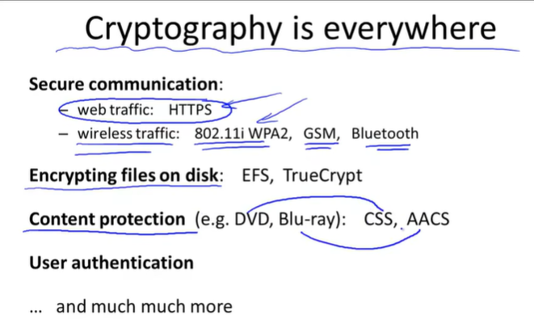

# **Dan Boneh's Cryptography**

## **Contents**

- [**Dan Boneh's Cryptography**](#dan-bonehs-cryptography)
  - [**Contents**](#contents)
  - [**Lecture 1 - Introduction**](#lecture-1---introduction)
    - [Usage](#usage)
    - [Classics - Weak Cypher](#classics---weak-cypher)

## **Lecture 1 - Introduction**

---

### Usage

> HTTP : hyper-text transmission protocol
>
> CSS : Content Scrambling System（How to Break）
>
> AACS
>
> HTTP - SSL / TLS

> > purpose : no eavesdropping / tampering

- **SSL / TLS**

- **Digital Sign's Mechanism**

- **Replace Authority with Protocol**

---

### Classics - Weak Cypher

- Ciser
- Vocani
- Rolar Machine
- 