# Contemporary Logic Design

---

## ***Contents***

- [Contemporary Logic Design](#contemporary-logic-design)
  - [***Contents***](#contents)
  - [**Chp1. Binary**](#chp1-binary)
    - [1.1 Complexity Control](#11-complexity-control)
    - [1.2 补码运算](#12-补码运算)
    - [1.3 逻辑门](#13-逻辑门)
        - [**！！Diagram**](#diagram)
    - [1.4 物理限制](#14-物理限制)
    - [1.5 CMOS](#15-cmos)
    - [**习题**](#习题)
  - [**Chp2. 组合逻辑** **- 化简动机**](#chp2-组合逻辑---化简动机)
    - [2.1 组合逻辑的定义](#21-组合逻辑的定义)
    - [2.2 布尔代数 - 公理定理 - 代数化简](#22-布尔代数---公理定理---代数化简)
        - [**！！整理**](#整理)
    - [2.3 布尔公式 - 电路实现 - 简述](#23-布尔公式---电路实现---简述)
        - [**！！2.3.2 时序 - Timing**](#232-时序---timing)
    - [2.4 2-level Logic 及化简动机](#24-2-level-logic-及化简动机)
    - [2.5 Multi-level Logic 及化简动机](#25-multi-level-logic-及化简动机)
    - [**习题**](#习题-1)
  - [**Chp3. 组合逻辑分析**](#chp3-组合逻辑分析)
    - [3.1 卡诺图 - 2-level化简](#31-卡诺图---2-level化简)
    - [3.2 自动化 - 2-level化简](#32-自动化---2-level化简)
    - [3.3 Multi-level化简](#33-multi-level化简)
    - [3.4  Multi-level化简的自动化 - Scripts](#34--multi-level化简的自动化---scripts)
    - [3.5 组合逻辑的时间响应 - Timing](#35-组合逻辑的时间响应---timing)
    - [**！！**3.6 组合逻辑模块 - 初探](#36-组合逻辑模块---初探)
    - [3.7 硬件设计语言 - 初探](#37-硬件设计语言---初探)
    - [**习题**](#习题-2)
  - [**Chp.4 组合逻辑技术 - High Level**](#chp4-组合逻辑技术---high-level)
  - [**Chp.5 组合逻辑技术的实例**](#chp5-组合逻辑技术的实例)
  - [**Chp.6 时序逻辑电路**](#chp6-时序逻辑电路)
  - [**Chp.6.5 硬件描述语言**](#chp65-硬件描述语言)
  - [**Chp.7 有限状态机 (FSA)**](#chp7-有限状态机-fsa)

---

## **Chp1. Binary**

---

### 1.1 Complexity Control

- Abstraction : Hide Details
- Discipline : 如行业标准
- 3 Principle
  - Hierarchy
  - Modularity
  - Regularity

---

### 1.2 补码运算

- **补码定义**：最高位（第n位）权值为

$$
b_{n-1} = -2^{n-1}
$$

> 故加到最大值$$2^{n-1}-1$$后，循环加法到最小值$$-2^{n-1}$$，构成加法循环群。

> 目的在于，可以表示负数，且正负数在同一运算系统下，可以直接相加。

- 符号扩展 （sign extension）

$$
0011 \Longrightarrow 0000011
\\1101 \Longrightarrow 1111101
$$

> 将符号位复制到所有扩展高位中

- 补码求法：按位取反加一 （易知）

---

### 1.3 逻辑门

- 定义 - Boolean Function

  > Input ：一个或多个二进制输入
  >
  > Output ：一个二进制输出

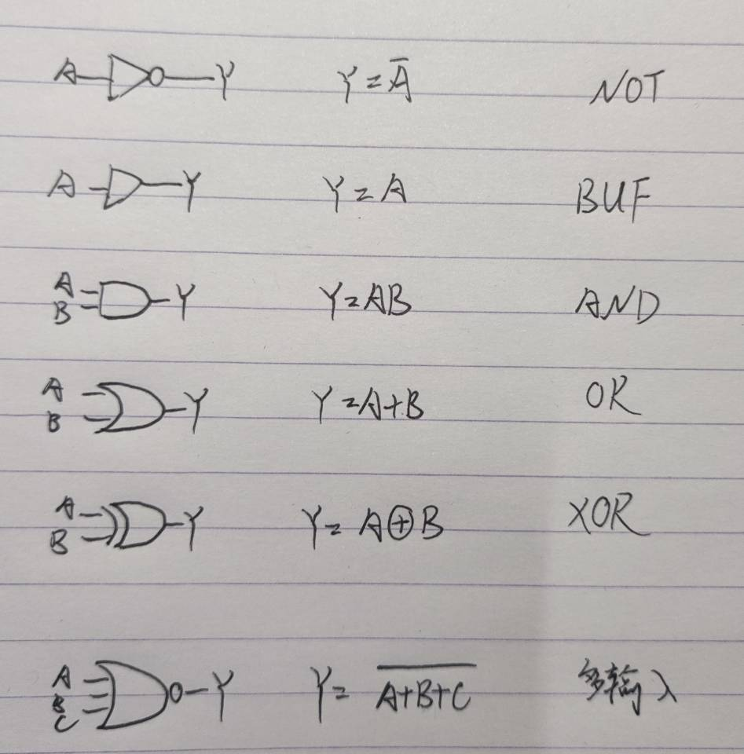

- NOT gate - bubble
- **BUF gate** - Buffer - 传输大电流 / 更快中继
- AND gate
- OR gate
- XOR - “exclusive OR” - 模2加法
- XNOR - “XOR + NOT” - 同或，为异或+1/-1/取反

##### **！！Diagram**

- 多输入门 - 上述几种扩展 - 多变量Boolean Expression

---

### 1.4 物理限制

- 电源电压
- **逻辑电平**

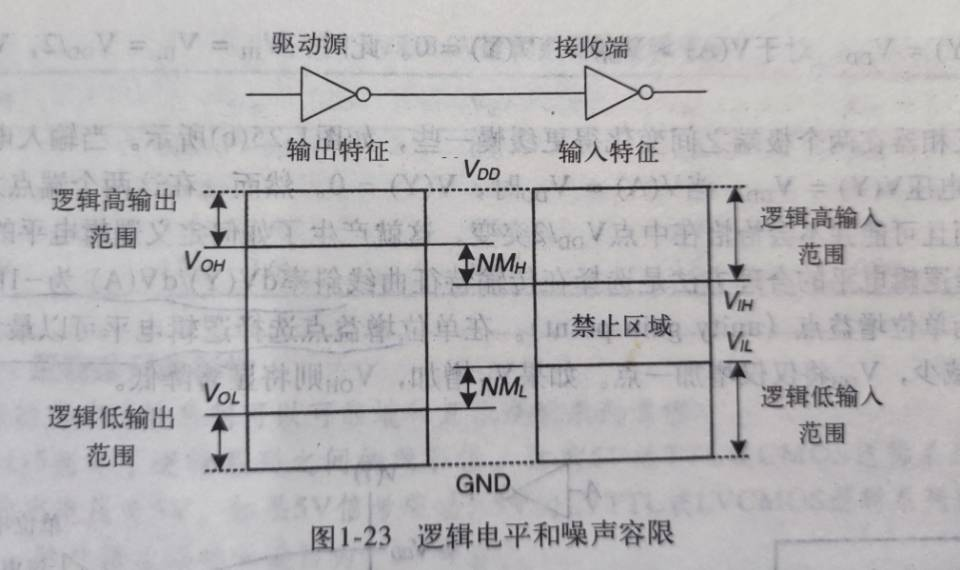

- 噪声容限：

$$
NM_L = V_{IL} - V_{OL}
\\NM_H = V_{OH} - V_{IH}
$$

- 静态约束（Q点）

  逻辑系列 - 行业标准 - 有兼容性

---

### 1.5 CMOS

- 構造と動作原理

- 素子からゲートを作る

- Dennard則, 消費電力

  - 动态功耗：0、1变化中电容充电的功耗

  $$
  P_{dynamic}={1 \over 2}CV^2_{DD}f
  $$

  > 1. **`C`充电到`VDD`电压，`f`为变换频率，每秒充+放共`f`次**
  >
  > 2. 由于放电不耗能量，只考虑充电，故1/2
  
  - 静态功耗：系统空闲时的功耗 - 漏电流 (leakage current)
    $$
    P_{static}=I_{DD}V_{DD}
    $$
    
  - Dennard Scaling - (Moore Law)
  
    2006年ころ崩壊

---

### **习题**

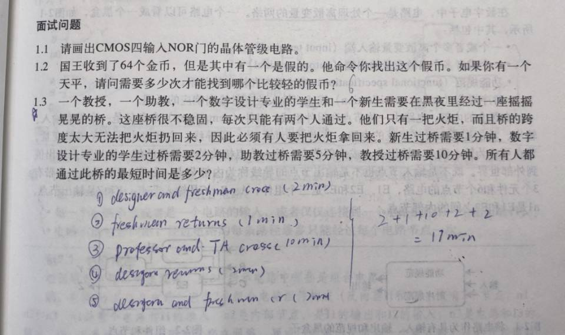

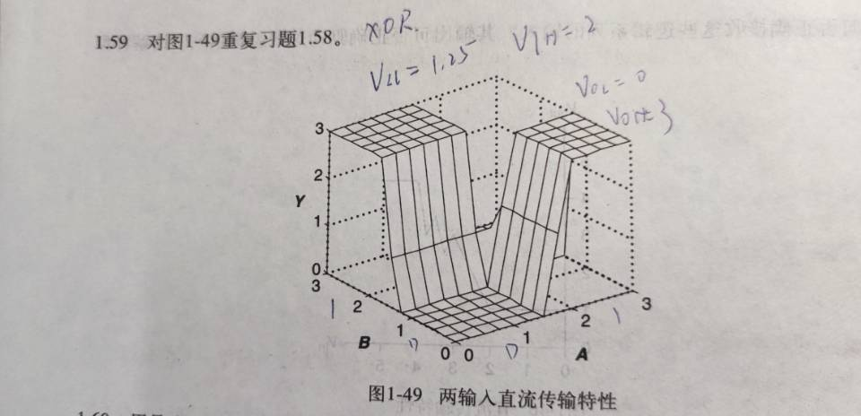

**Extensive Reading**

> 布尔代数 -Boole(1854)
>
> 开关电路，布尔代数的应用 -Shannon(1938)

---

[Back to Top](#contents)

## **Chp2. 组合逻辑** **- 化简动机**

---

>- 对比时序逻辑（Sequential）：无记忆性、无反馈
>- Discipline: 面积、速度、功耗、易设计

- 逻辑函数表达式 == 组合逻辑（out 仅取决于 in）（但可多输出）
- 组合逻辑分**2-level**和**Multi-level**
  - 2-level == 积之和/和之积 ()

---

### 2.1 组合逻辑的定义

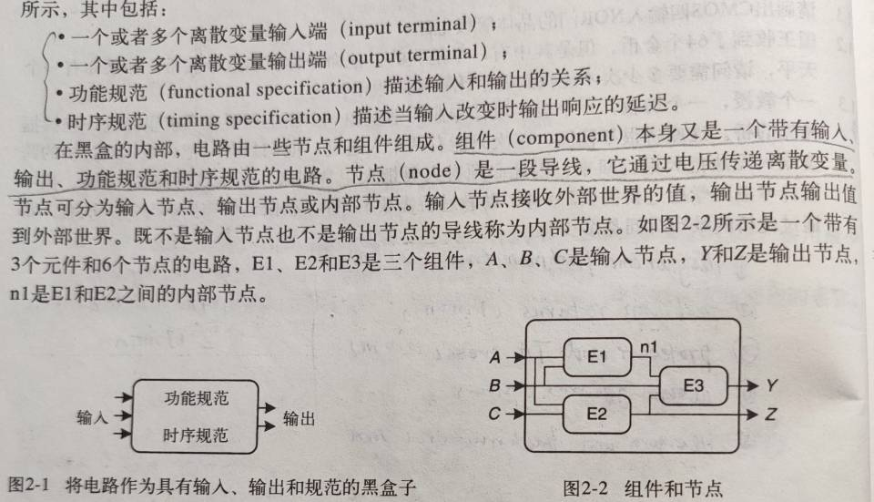

- Black Box 内部
  - component：E1、E2、E3
  - node：n1
- 组合逻辑电路
  - 功能规范：无记忆性
  - 时序（Timing）规范：In到Out的最大、最小延迟

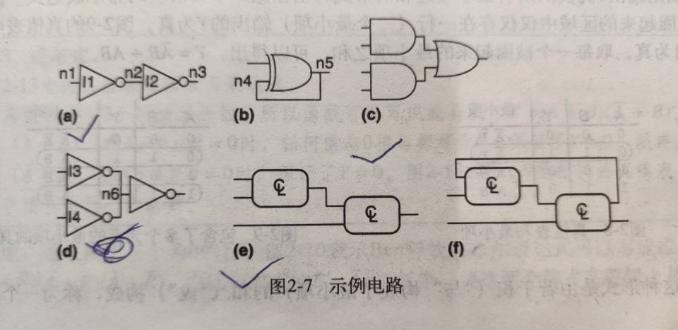

> 注意！：(d)不是组合电路，node6连接了两个输出

### 2.2 布尔代数 - 公理定理 - 代数化简

- 常用化简公式

$$
X+YZ=(X+Y)(X+Z)
$$

$$
BC+ \bar BD + CD = BC + \bar BD （多余项）
$$

$$
\bar ABC = \bar ABC + \bar ABC
$$

- 常用和、积 相互转化（化简、优化电路）

$$
F = \bar {\bar F}
\\F = (F^*)^*
$$

- 由对偶原理，二者等价（De Morgan ~ 取对偶 ~ 两种2-level logic互化）

$$
\bar F = F^*(\bar A_i)
$$

> $$
> A+AB = A （吸收律）\\ A+\bar AB = A+B（即X+YZ）
> $$
>
> 及各自对偶式

##### **！！整理**

- **XOR、XNOR** - 异或、同或
  - 1
  - 2
  - 3**Xor 运算律**

---

### 2.3 布尔公式 - 电路实现 - 简述

**2.3.1 电路原理图（schematic）**

- Notice：
  - 反向门代替单独反向器，减少门的数量
  - CMOS中与非门、或非门优于AND、OR门（指都NOT后再输入）
  - 全功能性知，可只用NOT、AND/OR两个 (德摩根)

**2.3.2 多级组合逻辑 - 减少硬件**

- **推气泡法**(就是DeMorgan lemma) - 优化CMOS电路

> > > > > > ---

**2.3.1 Module and Hierarchy** - 基本加法器为例

- Half-Adder

- Full-Adder

- 2-Bits-Adder

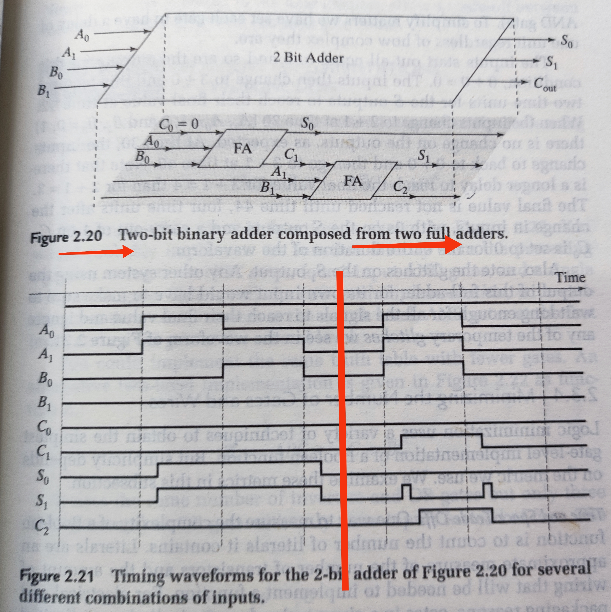

##### **！！2.3.2 时序 - Timing**

**2.3.3 电路最小化 - 3 metrics**

- 器件数、延迟速度、电路层级数

**2.3.4 实例：七段译码器**

---

### 2.4 2-level Logic 及化简动机

**2.4.1 二级逻辑定义**

- level-0 : A、B、C及其补

- level-1 : 最小项(AND)、最大项(OR)

- level-2 : 积之和、和之积

---

### 2.5 Multi-level Logic 及化简动机

- 为什么multi-level

  - 2-level只看穿过gate少，延时低，但需要多输入门
  - 多输入门内部实现上延时高（故最后不一定快），且面积大（目前科技上）
  - 多输入门组合时连接用的wire多，占面积大，设计困难

  > 综上，逻辑部件一般不多于3输入，主要采用Multi-level设计

- ##### 标准化简形式

> **note. 多项式除法、因式分解**

---

### **习题**

---

[Back to Top](#contents)

## **Chp3. 组合逻辑分析**

---

### 3.1 卡诺图 - 2-level化简

- 一般操作

- ##### 5、6 Literals 的操作

- **无关项**

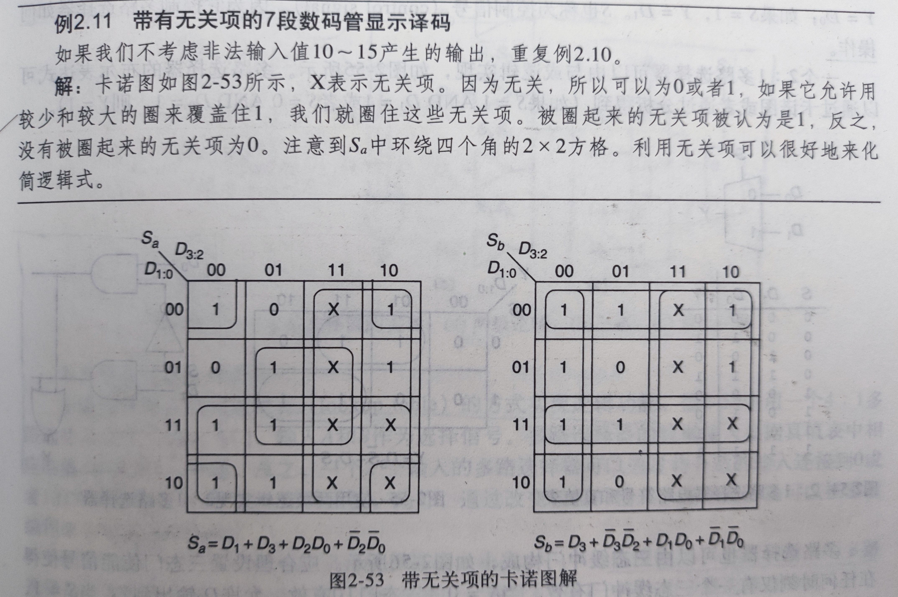

---

### 3.2 自动化 - 2-level化简

- 列表化简法（Quine-McCluskey算法）

[Implicant - Wiki](https://en.wikipedia.org/wiki/Implicant)

[Quine-McCluskey Algorithm](https://en.wikipedia.org/wiki/Quine%E2%80%93McCluskey_algorithm)

[Karnaugh map](https://en.wikipedia.org/wiki/Karnaugh_map)

***note***: 找质蕴涵式(prime implicant)为NP问题，最小覆盖(minimum set cover)为NP-C问题。常近似最优（eg. ***Espresso*** - ）。

> [More Logic Optimization](https://en.wikipedia.org/wiki/Logic_optimization)

- ##### Espresso化简器 - 迭代方式
  
  - 1
  - 2
  - 3
  - 4

---

### 3.3 Multi-level化简

- **2 Stage**

  - technology-independent stage

    > exploiting **mathematical properties** from Boolean Algebra

  - technology-dependent stage

    > 考虑实现时的技术限制，来做优化 (知常用模块)

- **5 Basic Operations**

  > 提供一些操作（有先后顺序），以向最少literals/gates/level目的性的优化电路
  >
  > 即，不是最优化，而是synthesis(综合)

  

  - Factoring - Node内提公因子，便于后续多项式除法
  - Decomposition - 新字母（中间函数）代换因子，分解节点，增加 level
  - Extraction - 找共用部分用新字母代换，复用性，增加 level

  - Substitution - 找已有节点能否被复用，G被F1、F2用，则重写F1、F2，并连线

  - Collapsing - Clean-up操作，将F中的G展开，为Sub的逆操作

    > 大规模电路中，若G复用性不高了（或G=A，用处不大），就用Collapsing还原回去，简化网路图

- Don't cares - 1、全局无关项、2、结构无关项

### 3.4  Multi-level化简的自动化 - Scripts

### 3.5 组合逻辑的时间响应 - Timing

### **！！**3.6 组合逻辑模块 - 初探

> **详细见 Chp.5 组合技术的几个实例**

> 注意 **代数式、原理图**、大规模时的优化？

> 基础部件，故可视为**真值表化简得来**

- **3个components** - Full-Adder（Half-Adder、2-bits Adder、**vice versa 减法器**）、优先级电路、7段译码器
- **2个components** - 多路选择器、译码器

**3.6.1 加法器** - (***半减器、全减器***) 见2.3.1 布尔代数的电路实现

**3.6.2 优先级电路**

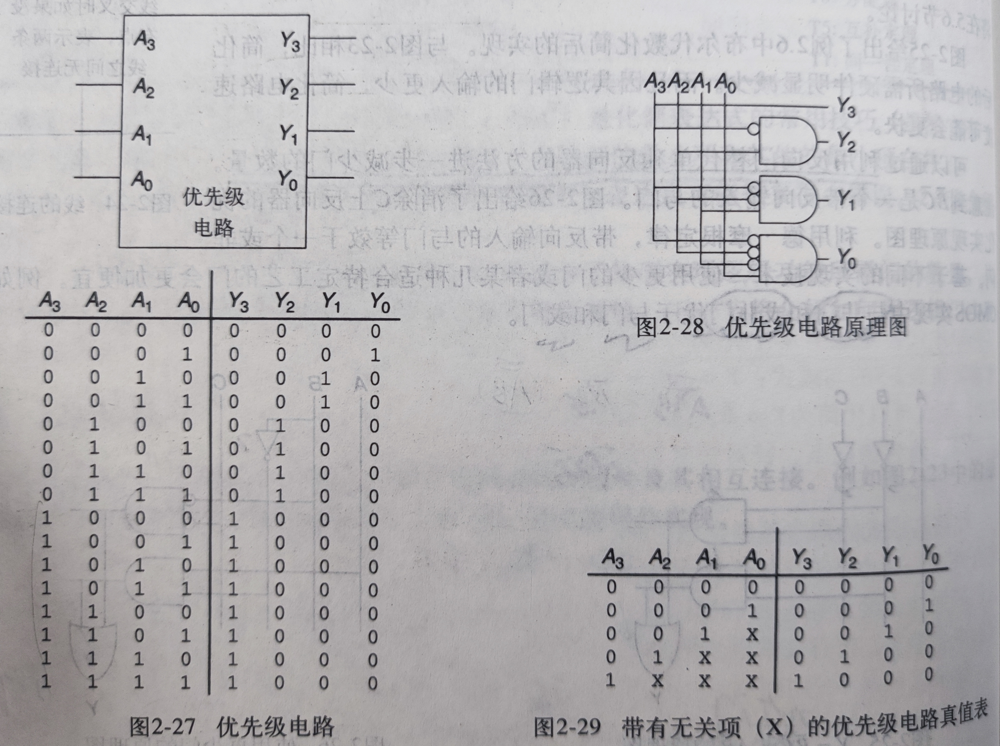

**3.6.3 七段译码器** - 见上文利用无关项

**3.6.4 多路选择器-multiplexer, mux**

> 从可能的几个输入中根据选择信号S-(select)的值来选择一个作为输出

> S也称控制信号(control signal)

- 2：1多路选择器

- **n：1多路选择器**

**3.6.4 DeMultiplexer，Demux（逆操作）**

**3.6.5 译码器**

> 分类器，独热 (one-hot)，视输入为n位二进制编号，只有一个输出为1（分的Class）

### 3.7 硬件设计语言 - 初探

> **详细见 Chp.6.5 硬件描述语言**

---

### **习题**

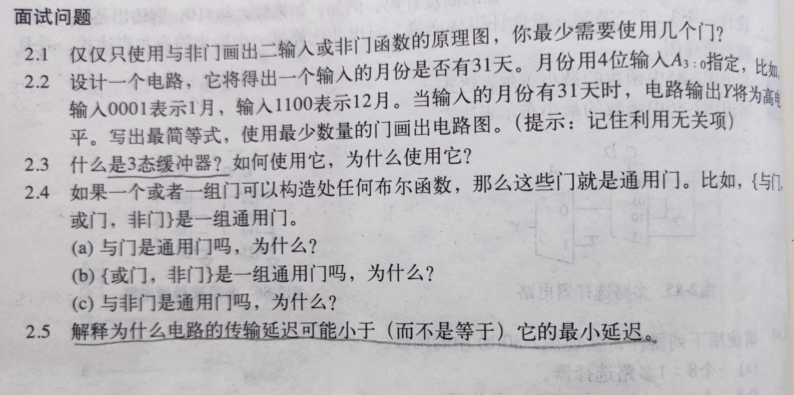

---

[Back to Top](#contents)

## **Chp.4 组合逻辑技术 - High Level**

## **Chp.5 组合逻辑技术的实例**

## **Chp.6 时序逻辑电路**

## **Chp.6.5 硬件描述语言**

## **Chp.7 有限状态机 (FSA)**

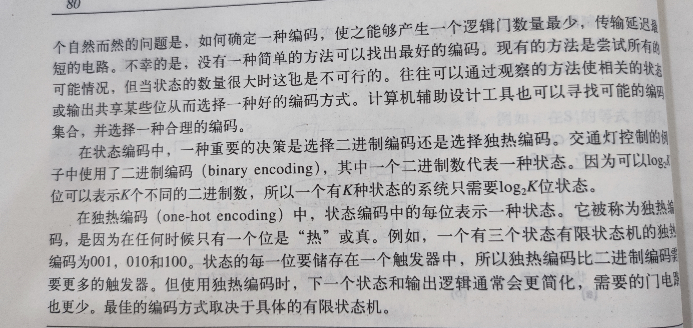

- Moore
- Mealy
