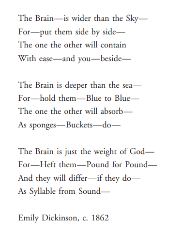

# **アンリミテッドルールブック**

## ***Contents***

- [**アンリミテッドルールブック**](#アンリミテッドルールブック)
  - [***Contents***](#contents)
  - [4、ちょっと差がつく『百人一首講座』](#4ちょっと差がつく百人一首講座)

---

1、Automaton - GOSICK中的土耳其行棋傀儡

>Thicknesse，当时是一个怀疑主义者，特意把傀儡找出来，想看看机器内部是什么样子。虽然他尊称肯佩伦为“一个非常有独创性的人”，他还是宣称傀儡是一个精心制作的骗局，**里面藏着一个小孩**，并形容机器“结构非常复杂……跟其他精巧的装置一样，误导、欺骗观众”。

> [Wiki - The Writer Automaton](https://web.archive.org/web/20210725024448/https://www.hopenglish.com/the-writer-automaton)

---

2、

> 

>     
<i>The Brain—is wider than the Sky—</i>

> 

> 
——Emily Dickinson

> [Wiki](https://zh.wikipedia.org/wiki/%E5%9F%83%E7%B1%B3%E8%8E%89%C2%B7%E7%8B%84%E6%9B%B4%E7%94%9F)

---

3、僕だけがいない街 -  取材

>  一部メディアのインタビューには、北海道のシーンを全て苫小牧市で撮影したとあるが、実際には白老町でも撮影されている

> 教室のシーンは、[白老町](https://ja.wikipedia.org/wiki/白老町)の[白老小学校](https://ja.wikipedia.org/wiki/白老町立白老小学校)旧校舎で行われた

---

## 4、ちょっと差がつく『百人一首講座』

『小倉百人一首』の中から一首ずつ、100首全てを解説。
百人一首の世界とともにお菓子を楽しみませんか？

[See More](https://ogurasansou.jp.net/columns_category/hyakunin/)

---

**4.1**

>心にも　あらでうき世に　ながらへば
>恋しかるべき　夜半の月かな
>
>
三条院（68番）　『後拾遺集』雑１・860

- 現代語訳

  > 心ならずも、このはかない現世で生きながらえていたならば、きっと恋しく思い出されるに違いない、この夜更けの月が。

- ことば

  「心にもあらで」

  >「心ならずも」とか「自分の本意ではなく」などという意味です。「に」は断定の助動詞「なり」の連体形、「で」は打消の接続助詞です。「心にもあらでうき世にながらへば」とあるので、本心では早くこの世を去りたいと思っていることを表しています。

  「うき世」

  > 「浮世」、「現世」のことで、「つらいこの世の中で」というような意味になっています。

  「ながらへば」

  > 「生き長らえているならば」という仮定の意味を表しています。
  > 下二段動詞「ながらふ」の未然形に接続助詞「ば」が付き、「これから長く生きているとすれば」という未来のことを想像する内容になっています。

  「恋しかるべき」

  > 「べき」は推量の助動詞(じょどうし)「べし」の連体形で、「夜半の月」にかかります

  「夜半(よは)の月かな」

  > 「夜半(よは)」は夜中(やちゅ)や夜更け(よふけ)のことで、「かな」は詠嘆(えいたん)の終助詞(しゅうじょし)です。全体では「この夜更けの月のことがなあ」という意味になります。

- 作者と鑑賞

  > [Wiki - 三条院](https://ja.wikipedia.org/wiki/%E4%B8%89%E6%9D%A1%E5%A4%A9%E7%9A%87)
  >
  > > 本当は死んでしまいたいくらいだけど、心ならずも生きながらえてしまったなら、今夜宮中から眺めているこの夜ふけの月が、きっとさぞかし懐かしく思い出されてくることだろうなあ。
  >
  > > 生きていることの辛さを歌う一首ですが、この歌にはちょっと複雑な背景があります。
  >
  > > ......そこで、疲れ果てた三条院はついに退位を決意します。その時に詠まれたのが、この歌なのです。権力闘争で疲れ果てた三条院には月の明かりはどのように映ったのでしょうか。

---

[タイトルに戻る](#Contents)

5、*Alice in Wonderland* - Lewis Carroll's dreams and storise

- [Lewis Carroll - a Mathematician](https://en.wikipedia.org/wiki/Lewis_Carroll)

  

  An avid puzzler, Carroll created the [word ladder](https://en.wikipedia.org/wiki/Word_ladder) puzzle (which he then called "Doublets").

  >More Puzzles - 
  >
  >[Guess number](https://www.quantamagazine.org/the-secret-math-behind-mind-reading-magic-tricks-20220527/#comments)
  >
  >[Collected-Web](don't remember)

