# 【数学】よく使われるLatex記号

转载自[Sakuyui's Blog](http://sakuyui.cn/2021/09/11/%E3%80%90%E6%95%B0%E5%AD%A6%E3%80%91%E3%82%88%E3%81%8F%E4%BD%BF%E3%82%8F%E3%82%8C%E3%82%8BLatex%E8%A8%98%E5%8F%B7/)

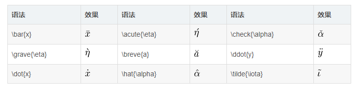

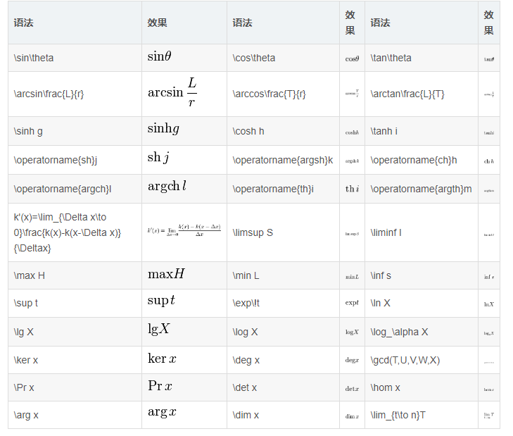

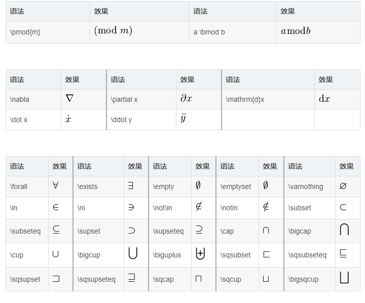

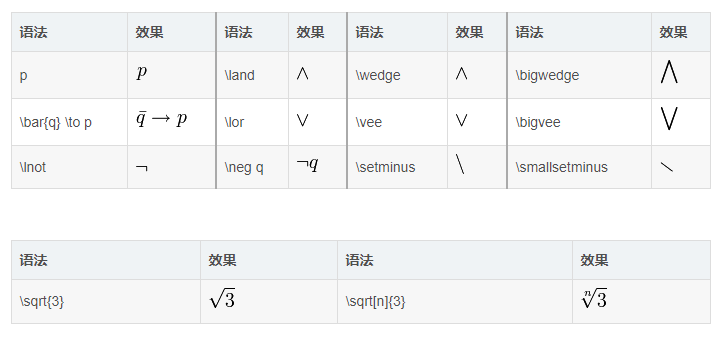

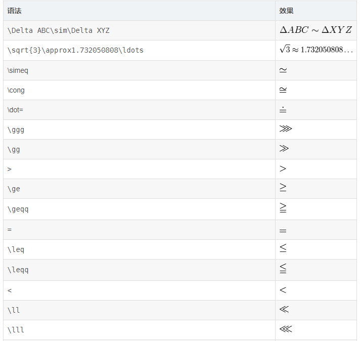

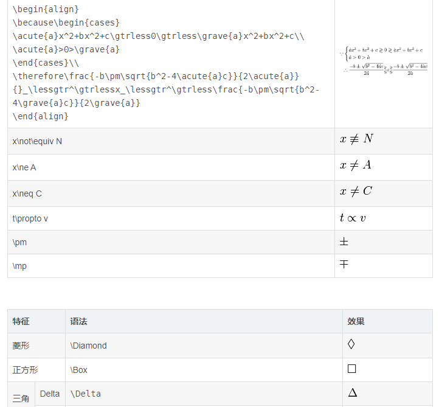

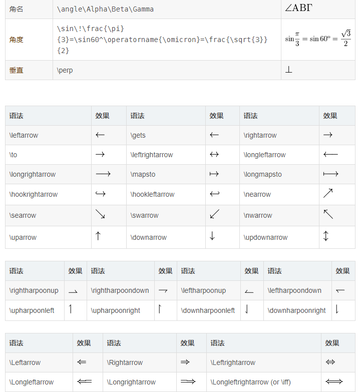

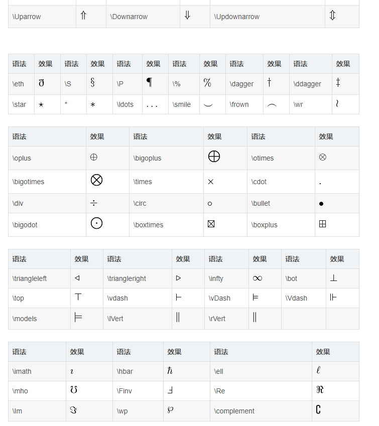

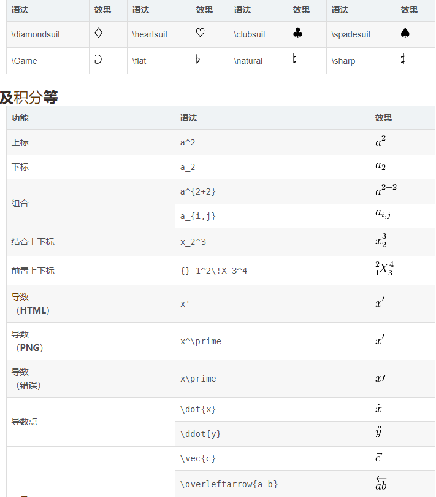

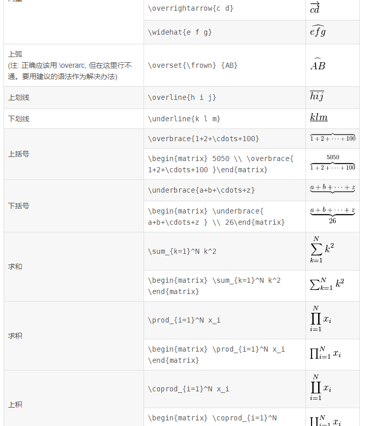

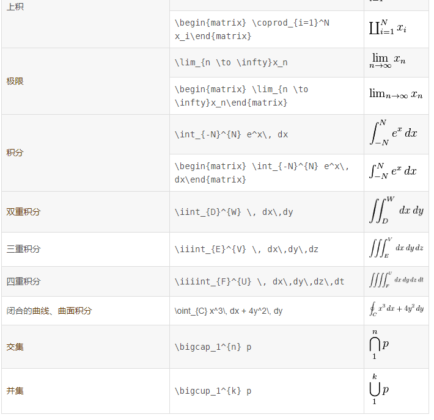

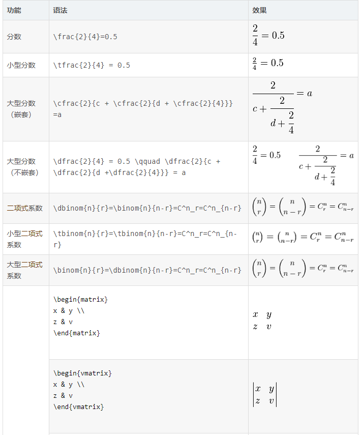

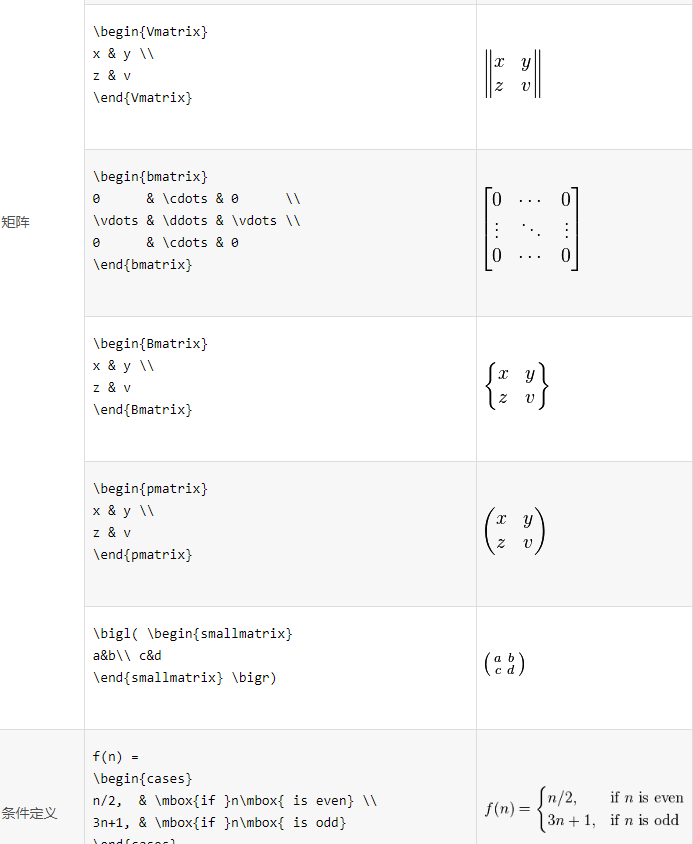

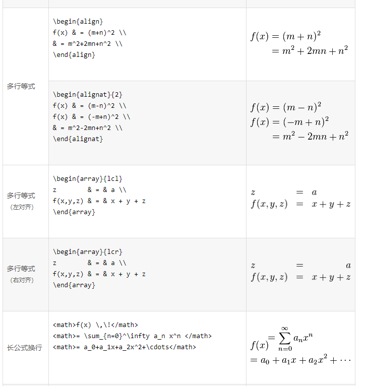

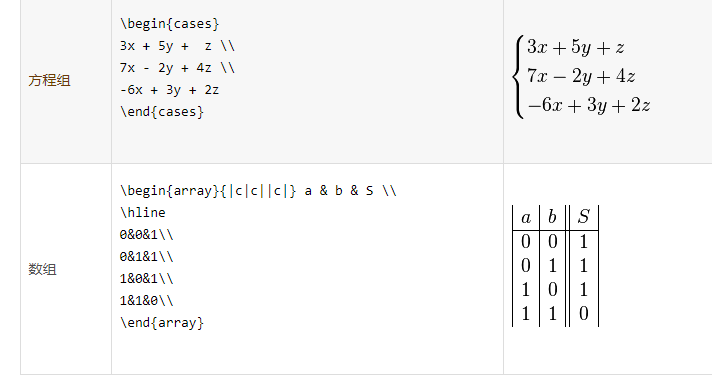

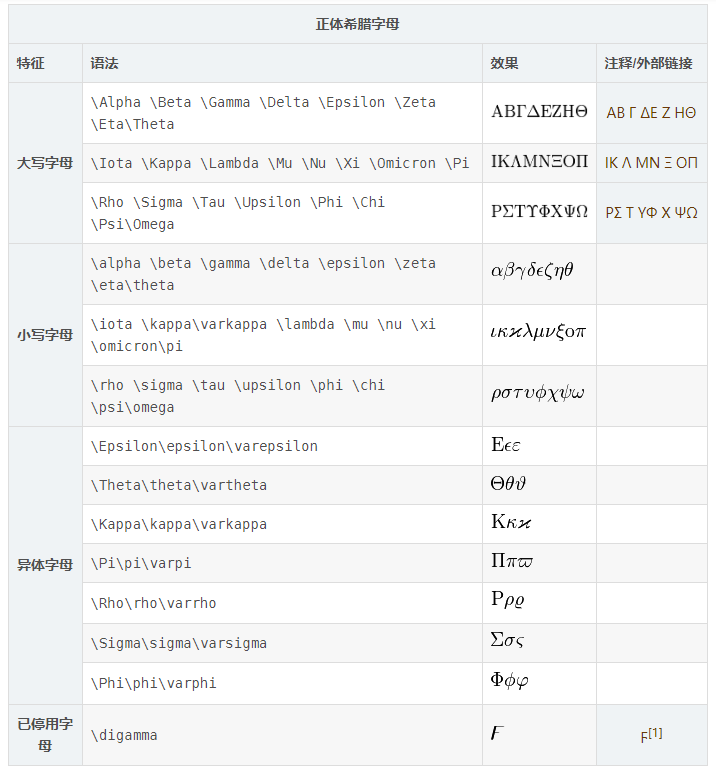

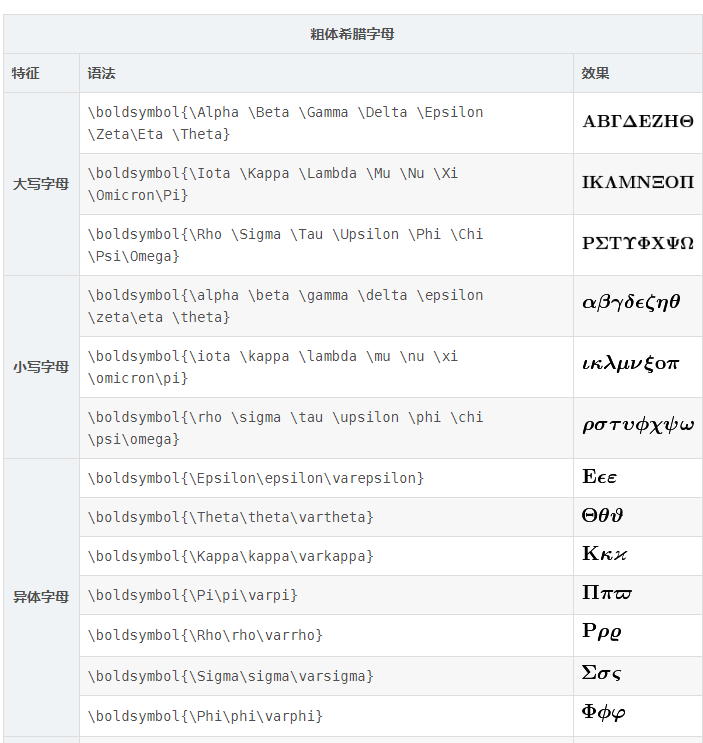