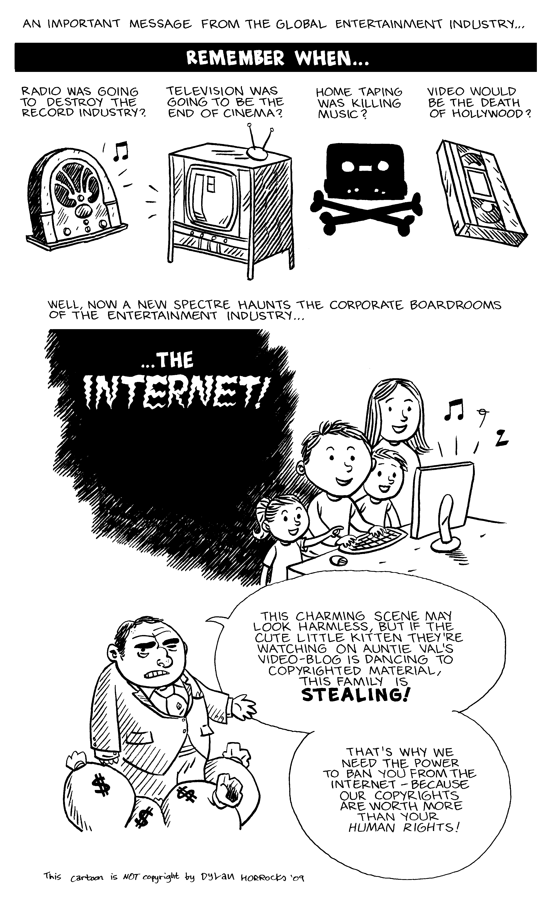
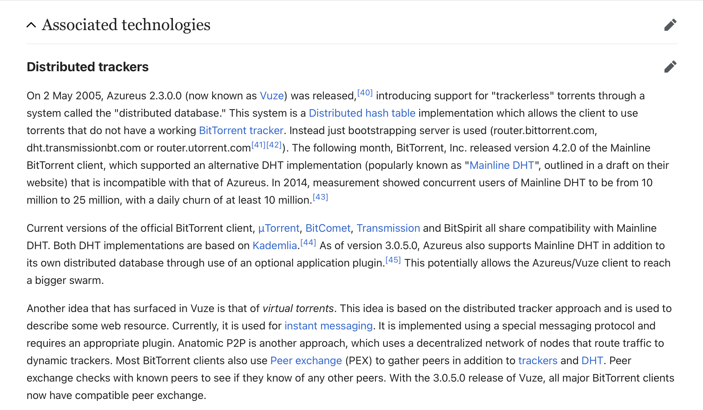
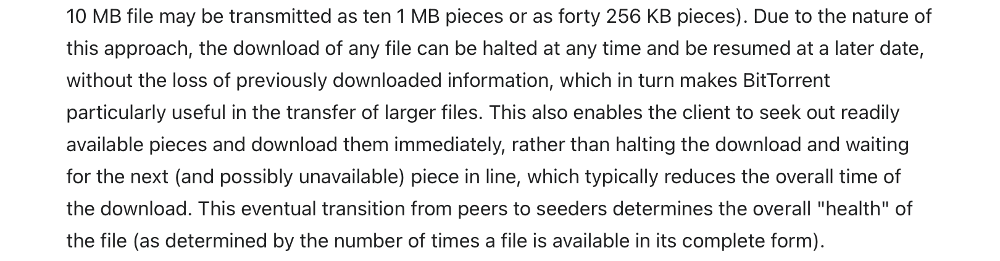
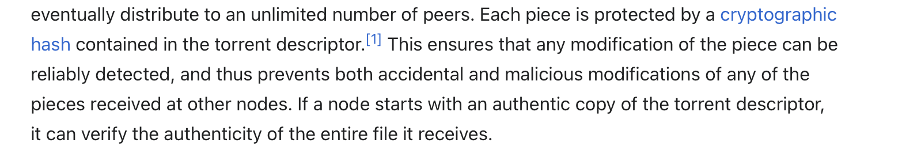
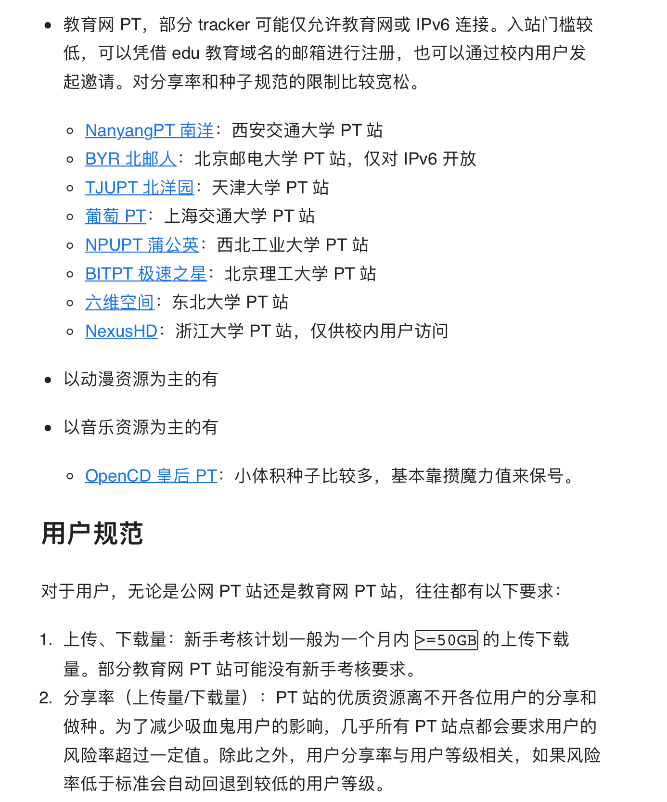

**BitTorrent，Private Torrent**

The replacement of the rarest first and choke algorithms can- not be justified in the context of peer-to-peer file replication in the Internet.

In May 2007, researchers at Cornell University published a paper proposing a new approach to searching a peer-to-peer network for inexact strings,[20] which could replace the functionality of a central indexing site. A year later, the same team implemented the system as a plugin for Vuze called Cubit[21] and published a follow-up paper reporting its success.[22]

The performance of peer-to-peer file replication comes from its piece and peer selection strategies.The performance of peer-to-peer file replication comes from its piece and peer selection strategies.

 **教育网PT站点**

.PNG)

**你真的需要一台成品 NAS 吗？**

买 NAS 是一个从满足到受气的过程：收到包裹后满心欢喜，看什么都觉得新鲜；使用一段时间后觉得索然无味，还不如用回 OneDrive；到了后期遇到各种 Bug 和反人类的 UI/UE 设计，以 ticket 为武器向售后发泄怒火。

家庭用户买 NAS，无非为了以下几点需求，但都有对应的替代品

- 照片备份 => OneDrive/iCloud/Google Drive/…
- PT 下载 => qBittorrent/libtorrent/rtorrent/…
- 数据备份 => rclone/rsync/btrfs-send/…
- 文件同步 => OwnCloud/NextCloud/…
- 文件读写 => Samba/nfs-kernel-server/…
- VPN 访问 => ZeroTier/WireGuard/OpenVPN/…
- 虚拟化 => ESXi/Docker/LXC/LXD/…

如果你有一定技术能力，搭建一台运行 VMware ESXi 的 x86 服务器是最理想的。当然，群晖和威联通卖的就是成套解决方案，对于不那么折腾、不那么挑剔的一般家庭用户（非设计师、非程序员）来说，成品 NAS 产品最适合不过了。