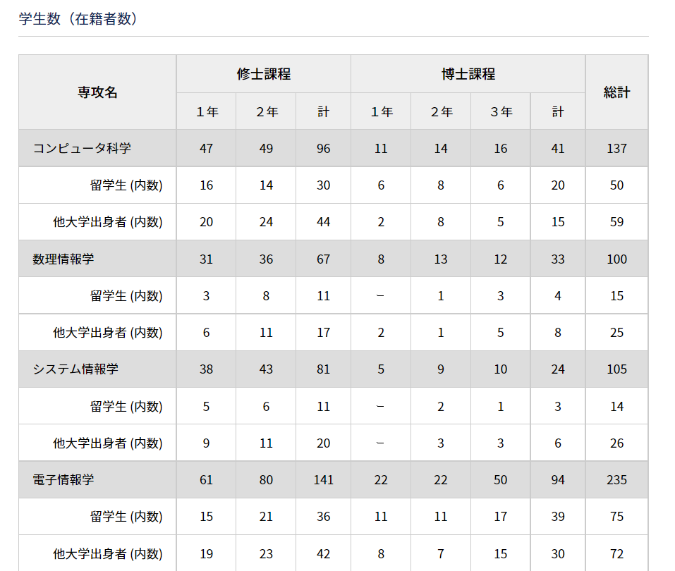
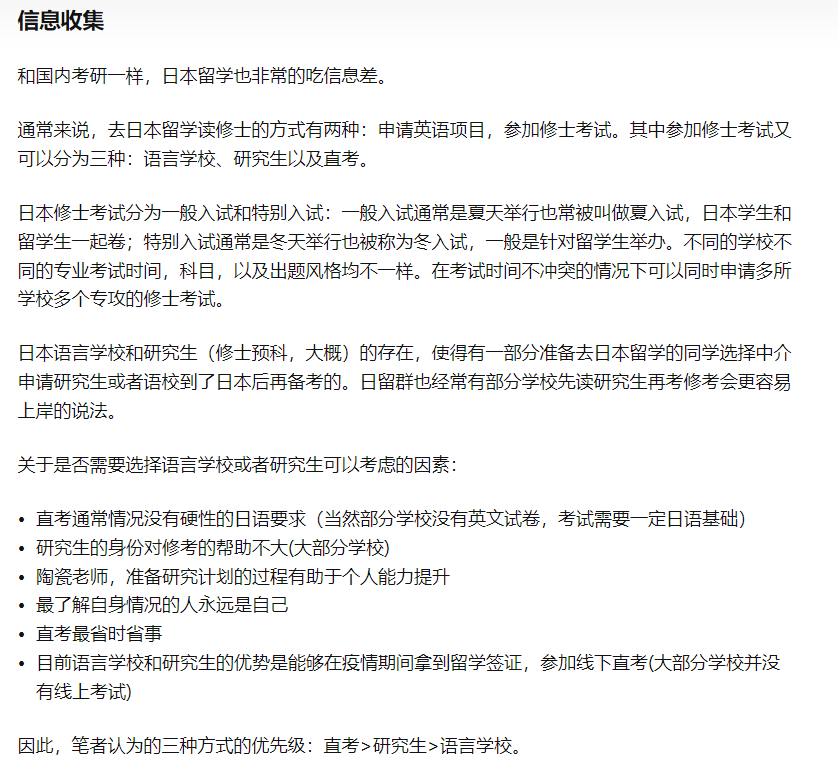

# **Contents**

- [**Contents**](#contents)
  - [**东大情报理工**](#东大情报理工)
    - [**大学院入試説明会について（終了しました）**](#大学院入試説明会について終了しました)
    - [**書籍リスト(Book List)**](#書籍リストbook-list)
    - [**入学希望者向けFAQ**](#入学希望者向けfaq)
      - [出願手続き](#出願手続き)
      - [TOEFL](#toefl)
      - [奨学金](#奨学金)
      - [！！指導教員を探す](#指導教員を探す)
      - [授業／コース](#授業コース)
      - [過去問](#過去問)
      - [大学院外国人研究生](#大学院外国人研究生)
    - [**研究科データ(概要)**](#研究科データ概要)
  - [**签证**](#签证)
  - [**套磁**](#套磁)
  - [**Tips**](#tips)
  - [**PS.定番データベース**](#ps定番データベース)
  - [**PS.講義一覧**](#ps講義一覧)

## **东大情报理工**

### **大学院入試説明会について（終了しました）**

以下のとおり実施いたします。
参加をご希望の場合は参加希望票への入力をお願いいたします。
参加希望票を入力された方には、説明会参加者のための専用ウェブサイトのURLが通知されます。

日程：2022年5月21日（土）

実施形態：ZOOMによるオンライン開催
※説明会へのご参加前に各専攻紹介動画（専用ウェブサイト上に掲載）を各自でご視聴いただきます。

**時間：**　
**＜研究科全体説明会＞
**内容：大学院情報理工学系研究科について、入学後の教育プログラムについて
日本語版： 13時～13時30分 (日本時間)
英語版： 13時30分～14時 (日本時間)

**＜専攻別説明会＞
**内容：研究室紹介、見学等（専攻により異なります）
14時15分～ (日本時間)

【各専攻の入試案内】

- [コンピュータ科学](https://www.i.u-tokyo.ac.jp/edu/course/cs/admission.shtml)
- [数理情報学](https://www.i.u-tokyo.ac.jp/edu/course/mi/admission.shtml)
- [システム情報学](https://www.i.u-tokyo.ac.jp/edu/course/ipc/admission.shtml)
- [電子情報学](https://www.i.u-tokyo.ac.jp/edu/course/ice/admission.shtml)
- [知能機械情報学](https://www.i.u-tokyo.ac.jp/edu/course/m-i/admission.shtml)
- [創造情報学](https://www.i.u-tokyo.ac.jp/edu/course/ci/admission.shtml)

---

### **書籍リスト(Book List)**

| **情報数学 (Information Mathematics)**                       |
| ------------------------------------------------------------ |
| 榎本 彦衛: 情報数学入門, 新曜社, 1987                        |
| Rudolf Lidl, Gunter Pilz: Applied Abstract Algebra, Springer, 1998 |

| **数値計算（Numerical Algorithms)**                          |
| ------------------------------------------------------------ |
| 久保田 光一: 工学基礎 数値解析とその応用, 数理工学社, 2010   |
| E. クライツィグ (田村 義保 訳): 数値解析 (技術者のための高等数学 5), 培風館, 2003 |
| Erwin Kreyszig: Advanced Engineering mathematics (Part E: Numerical Methods), John Wiley & Sons, 2011 |

| **離散数学 (Discrete Mathematics)**                          |
| ------------------------------------------------------------ |
| J. マトウシェック, J. ネシェトリル (根上 生也, 中本 敦浩 訳): 離散数学への招待 (上, 下), 丸善出版， 2002 |
| Jiri Matousek, Jaroslav Nesetril: Invitation to Discrete Mathematics, Oxford University Press, 2009 |

| **アルゴリズムと計算量 (Algorithms and Complexity)**         |
| ------------------------------------------------------------ |
| 五十嵐 健夫: データ構造とアルゴリズム, 数理工学社, 2007      |
| Robert Wayne, Kevin Sedgewick: Algorithms, Addison-Wesley, 2011 |

| **形式言語 (Formal Languages)**                              |
| ------------------------------------------------------------ |
| J. ホップクロフト, R. モトワニ, J. ウルマン (野崎 昭弘, 高橋 正子, 町田 元, 山崎 秀記 訳): オートマトン 言語理論 計算論 I (第2版), サイエンス社， 2003 |
| John E. Hopcroft, Rajeev Motwani, Jeffrey D. Ullman: Introduction to Automata Theory, Languages, and Computation (Chapters 1–7), Pearson, 2013 |

| **論理学 (Logic)**                                           |
| ------------------------------------------------------------ |
| 萩谷 昌己, 西崎 真也: 論理と計算のしくみ (1, 2, 4章), 岩波書店, 2007 |
| Dirk van Dalen: Logic and Structure (Chapters 1–3, 7), Springer-Verlag, 2011 |

| **プログラミング言語論 (Programming Languages)**             |
| ------------------------------------------------------------ |
| A. W. Appel (神林 靖, 滝本 宗宏 訳): 最新コンパイラ構成技法, 翔泳社, 2009 |
| B. C. Pierce (住井 英二郎 監訳): 型システム入門 —プログラミング言語と型の理論— (1–5, 8–9, 22章), オーム社, 2013 |
| Andrew W. Appel: Modern Compiler Implementation in ML, Cambridge University Press, 2004 |
| Benjamin C. Pierce: Types and Programming Languages (Chapters 1–5, 8–9 and 22), The MIT Press, 2002 |

| **計算機アーキテクチャ (Computer Architecture)**             |
| ------------------------------------------------------------ |
| David A. Patterson, John L. Hennessy: パターソン&ヘネシー コンピュータの構成と設計 ハードウェアとソフトウェアのインターフェース 第5版 上巻, 2014 |
| David A. Patterson, John L. Hennessy: パターソン&ヘネシー コンピュータの構成と設計 ハードウェアとソフトウェアのインターフェース 第5版 下巻, 2014 |
| David A. Patterson, John L. Hennessy: Computer Organization and Design MIPS Edition, Fifth Edition: The Hardware/Software Interface, Morgan Kaufmann, 2013 |

| **デジタル回路　(Digital Circuit)**                          |
| ------------------------------------------------------------ |
| David Money Harris, Sarah L. Harris: ディジタル回路設計とコンピュータアーキテクチャ（第2版）, 翔泳社, 2017 |
| David Money Harris, Sarah L. Harris: Digital Design and Computer Architecture, Second Edition, Morgan Kaufmann, 2012 |

| **オペレーティングシステム (Operating Systems)**             |
| ------------------------------------------------------------ |
| A. Silberschatz, P.B. Galvin, G. Gagne (土居 範久 監訳): オペレーティングシステムの概念, 共立出版, 2010 |
| Abraham Silberschatz, Peter B. Galvin, Greg Gagne: Operating System Concepts, 9th Edition, Wiley, 2013 |

| **機械学習 (Machine Learning)**                              |
| ------------------------------------------------------------ |
| 杉山 将: 統計的機械学習 —生成モデルに基づくパターン認識, オーム社, 2009 |
| 中川 裕志: 機械学習, 丸善出版, 2015                          |
| Trevor Hastie, Robert Tibshirani, Jerome H. Friedman: The Elements of Statistical Learning, Springer, 2009 |

| **グラフィクス (Graphics)**                                  |
| ------------------------------------------------------------ |
| コンピュータグラフィックス 改訂新版, CG-ARTS協会, 2015       |
| Peter Shirley, Steve Marschner: Fundamentals of Computer Graphics, A K Peters, 2015 |

| **自然言語処理 (Natural Language Processing)**               |
| ------------------------------------------------------------ |
| 奥村 学: 自然言語処理の基礎, コロナ社, 2010                  |
| 黒橋禎夫: 自然言語処理, 放送大学教育振興会, 2019             |
| Dan Jurafsky and James H. Martin: Speech and Language Processing: International Edition, Pearson, 2008 |

| **バイオインフォマティクス (Bioinformatics)**                |
| ------------------------------------------------------------ |
| A. ポランスキ, M. キンメル (後藤 修 訳): バイオインフォマティクス, 丸善出版, 2012 |
| バイオインフォマティクス事典, 共立出版, 2006                 |
| Uri Alon (倉田 博之, 宮野 悟 訳): システム生物学入門 —生物回路の設計原理, 共立出版, 2008 |
| Andrzej Polanski, Marek Kimmel: Bioinformatics, Springer, 2007 |
| Neil C. Jones, Pavel A. Pevzner: An Introduction to Bioinformatics Algorithms, MIT Press, 2004 |
| Uri Alon: An Introduction to Systems Biology: Design Principles of Biological Circuits, Chapman & Hall/Crc, 2006 |
| Warren J. Ewens, Gregory R. Grant: Statistical Methods in Bioinformatics: An Introduction, Springer, 2010 |

| **コンピュータビジョン (Computer Vision)**                   |
| ------------------------------------------------------------ |
| ディジタル画像処理, CG-ARTS協会, 2015                        |
| Richard Szeliski: Computer Vision: Algorithms and Applications, Springer, 2011 |

---

### **入学希望者向けFAQ**

#### 出願手続き

Q. 外国人留学生に関する入試情報（修士・博士課程）はどこにありますか。

A. 入試には通常の入試と特別入試（ "English Program on Intelligent Information Processing"）の2種類があり、通常入試の情報は[こちら](https://www.i.u-tokyo.ac.jp/edu/entra/index.shtml) 、 特別入試の情報は[こちら](https://www.i.u-tokyo.ac.jp/edu/entra/epiip_e.shtml) にあります。

Q. 私は、日本以外に在住している外国人学生です。8月の夏入試に合格すれば、10月に入学できますか。

A. はい。制度上はできます。ただし、学生ビザの取得に2-3ヶ月ほど時間がかかるため、10月入学を選択すると、入学時に渡日が間に合わない場合がございます。そのため、4月入学を強くおすすめします。

#### TOEFL

Q. 私は英語のネイティヴスピーカーですが、TOEFLスコアを提出する必要がありますか。

A. はい。英語のネイティヴスピーカーであるかどうかにかかわらず、受験者は全員TOEFLスコアの提出が必要です。

Q. TOEFLスコアの代わりにIELTSやTOEICのスコアを提出できますか。

A. できません。

Q. 前回の入試で使用したTOEFL-iBTのスコアを、次の入試にも利用できますか。

A. 「TOEFL 成績提出要項」に明記された期間内に受験したスコアであれば、次の入試でも利用できます。ただし、次の入試出願時に、改めて本研究科へのスコア送信をETSに依頼する必要があるので、ご注意ください。

＊詳細は[こちら](https://www.i.u-tokyo.ac.jp/edu/entra/index.shtml)のページをご覧ください。

#### 奨学金

Q. 留学生のための奨学金の情報はどこにありますか。

A. [こちら](https://www.u-tokyo.ac.jp/adm/inbound/ja/finance-scholarships.html)のページをご覧ください。

> [日本に来る前に申し込める奨学金](https://www.u-tokyo.ac.jp/adm/inbound/ja/finance-scholarships-before.html)
>
> > - [日本政府（文部科学省）奨学金留学生　（国費外国人留学生）](https://www.u-tokyo.ac.jp/adm/inbound/ja/programs-admissions-m.html)
> >
> > - [東京大学外国人留学生特別奨学制度（東京大学フェローシップ）](https://www.u-tokyo.ac.jp/adm/inbound/ja/finance-scholarships-fe.html)
>
> [東京大学・日本政府の奨学金](https://www.u-tokyo.ac.jp/adm/inbound/ja/finance-scholarships-ug.html)
>
> 
>
> [民間団体による奨学金](https://www.u-tokyo.ac.jp/adm/inbound/ja/finance-scholarships-po.html)

Q. MEXT奨学金（日本政府（文部科学省）奨学金）は、留学生全員が受給できますか。

A. いいえ。MEXT奨学金は、留学生全員に支給されるわけではありません。MEXT奨学金については、[こちら](https://www.u-tokyo.ac.jp/adm/inbound/ja/programs-admissions-m.html)をご覧ください。他の奨学金を含め、詳しい情報を知りたい場合は、[国際交流室](https://www.i.u-tokyo.ac.jp/edu/inter_ex/oir/index.shtml)にご相談ください。

#### ！！指導教員を探す

Q. 指導教員はどのように探せばよいですか。

A. 研究分野ごとの[教員一覧ページ](https://www.i.u-tokyo.ac.jp/news/search_e/search-a_e.shtml)（英語）を参照の上、希望する指導教員へ電子メールで直接ご連絡ください。

Q. 指導を希望する教員には、事前に連絡した方がよいですか。

A. どの専攻に出願するかにより異なります。志望する専攻の入試案内書をよく読んでください。

#### 授業／コース

Q. 英語で行われている授業はありますか。

A. 英語で行われている授業一覧は、[こちら](https://www.i.u-tokyo.ac.jp/edu/proced/sche_sa_e.shtml)です。

Q. 授業の内容を詳しく知りたいのですが、どうすればよいですか。

A. 「[東京大学授業カタログ](https://catalog.he.u-tokyo.ac.jp/)」にアクセスし、以下の手順で検索してください。

1. 「大学院」のタブを選びます。
2. プルダウンメニューから、「情報理工学系研究科」を選びます。
3. 検索したい研究分野のキーワードや科目名、科目番号等を入力すると、該当する科目が表示されます。ここから授業内容や使用言語を見ることができます。

Q. パートタイムのコースはありますか。

A. パートタイムのコースはありませんが、職に就いているなどの理由により、標準修業年限内での大学院教育課程の履修が困難な場合は「[長期履修制度](https://www.i.u-tokyo.ac.jp/edu/inter_ex/oir/pdf/long-term-completion_j.pdf)」への申請が可能です。

#### 過去問

Q. 過去問はどこで入手できますか。

A. [こちら](https://www.i.u-tokyo.ac.jp/edu/entra/examarchive.shtml)で公開しています。

#### 大学院外国人研究生

Q. 「大学院外国人研究生」とは何ですか。どのように応募すれば良いですか。

A. [こちら](https://www.i.u-tokyo.ac.jp/edu/entra/research_students_e.shtml)（英語）をご覧ください。

---

### **研究科データ(概要)**

- **Statistics**

> **note: 入学者の選抜方法は、 夏入試、冬入試、知的情報処理英語プログラム特別選抜( iip ) 合計三つの方法があります**

- **Purpose**

---

[Back to Top](#contents)

## **签证**

---

- **签证办理方式**

---

## **套磁**

---

---

## **Tips**

> - **关于概率论**
>
> 基本还是**排列组合母函数数列**，和数论占边的一概不需要看
>
> 由于本人数竞出身，概率方面基本除过去问以外未进行学习，从历年出题的经验上来看，考点莫过于**基础组合计数问题的方法（基础排列组合，卡特兰数等等），生成函数（母函数）方法，动态规划（递推数列）。（过去问也考过组合恒等式的证明，莫过于算两次和母函数的思想）**
>
> **东大尤其喜欢的套路是先求个离散型分布，再让你列个递推式，然后累加求个母函数，最后求导算个期望，变通运用的能力尤为重要。**
>
> 过去问前几年很喜欢考**变分法**，还是值得一看。

>- 
>
>

## **PS.定番データベース**

このページでは、[附属図書館データベース一覧](https://www.lib.u-tokyo.ac.jp/ja/library/contents/database)のなかで、良く利用されるデータベースを集めてあります。

東京大学で使える資料を探す
■[E-journal & E-book Portal ](https://www.lib.u-tokyo.ac.jp/ja/library/contents/database/1)
■[東京大学OPAC](https://www.lib.u-tokyo.ac.jp/ja/library/contents/database/3)
■[TREE（UTokyo REsource Explorer）](https://www.lib.u-tokyo.ac.jp/ja/library/contents/database/2)

辞書・辞典・コレクション
■[JapanKnowledge Lib](https://www.lib.u-tokyo.ac.jp/ja/library/contents/database/4)　/ ■[Oxford English Dictionary (2nd ed.)](https://www.lib.u-tokyo.ac.jp/ja/library/contents/database/194)

国内文献情報データベース（主に論文を探す）
■[CiNii Research](https://www.lib.u-tokyo.ac.jp/ja/library/contents/database/62)
海外文献情報データベース（主に論文を探す）
■[Web of Scienceコアコレクション](https://www.lib.u-tokyo.ac.jp/ja/library/contents/database/6)　/ ■[Scopus](https://www.lib.u-tokyo.ac.jp/ja/library/contents/database/7)
複数のデータベースをまとめて利用できる（主に論文を探す）
■[EBSCO host](https://www.lib.u-tokyo.ac.jp/ja/library/contents/database/8)　/ ■[ProQuest](https://www.lib.u-tokyo.ac.jp/ja/library/contents/database/9)

国内新聞
■[朝日新聞クロスサーチ](https://www.lib.u-tokyo.ac.jp/ja/library/contents/database/438) / ■[読売新聞（ヨミダス歴史館）](https://www.lib.u-tokyo.ac.jp/ja/library/contents/database/13) / ■[毎日新聞（毎索）](https://www.lib.u-tokyo.ac.jp/ja/library/contents/database/12) / ■[日本経済新聞（日経テレコン21）](https://www.lib.u-tokyo.ac.jp/ja/library/contents/database/11)
海外新聞
■[PressReader](https://www.lib.u-tokyo.ac.jp/ja/library/contents/database/14) / ■[Nexis Uni](https://www.lib.u-tokyo.ac.jp/ja/library/contents/database/186) / ■[人民日報データベース](https://www.lib.u-tokyo.ac.jp/ja/library/contents/database/341)

雑誌記事
■[日経BP](https://www.lib.u-tokyo.ac.jp/ja/library/contents/database/391) / ■[ざっさくプラス ](https://www.lib.u-tokyo.ac.jp/ja/library/contents/database/288)/ ■[Web OYA-bunko（大宅壮一文庫 雑誌記事索引検索　Web版）](https://www.lib.u-tokyo.ac.jp/ja/library/contents/database/263) 

分野別（主に論文を探す）
■[Engineering Village](https://www.lib.u-tokyo.ac.jp/ja/library/contents/database/95)（工学系）/ ■[MathSciNet](https://www.lib.u-tokyo.ac.jp/ja/library/contents/database/173)（数学）
■[PubMed](https://www.lib.u-tokyo.ac.jp/ja/library/contents/database/215)（医学） /　■[医中誌Web](https://www.lib.u-tokyo.ac.jp/ja/library/contents/database/300)（医学） /　■[CINAHL Plus with Full Text](https://www.lib.u-tokyo.ac.jp/ja/library/contents/database/59)(看護）
■[CAS SciFinder-n](https://www.lib.u-tokyo.ac.jp/ja/library/contents/database/57) (化学）
■[JSTOR](https://www.lib.u-tokyo.ac.jp/ja/library/contents/database/146)（人文社会学系）■[LEX/DBインターネット](https://www.lib.u-tokyo.ac.jp/ja/library/contents/database/158)（法学）

言語別
■[CNKI](https://www.lib.u-tokyo.ac.jp/ja/library/contents/database/63)（中国語）　/ ■[KISS](https://www.lib.u-tokyo.ac.jp/ja/library/contents/database/152)（韓国語）　/ ■[DBpia](https://www.lib.u-tokyo.ac.jp/ja/library/contents/database/72)（韓国語）

その他
■[Journal Citation Reports (JCR)](https://www.lib.u-tokyo.ac.jp/ja/library/contents/database/140)

文献管理ツール
■[新RefWorks ](https://refworks.proquest.com/) / ■[Mendeley ](https://www.mendeley.com/?interaction_required=true)/ ■[Endnote online ](https://access.clarivate.com/login?app=endnote)

---

## **PS.講義一覧**

- **コンピュータ科学（2022年度）2022.9.07時点**

  [Lectures](https://www.i.u-tokyo.ac.jp/edu/course/cs/lectures.shtml)

- **創造情報学（2022年度）2022.3.30時点**

  [Lectures](https://www.i.u-tokyo.ac.jp/edu/course/ci/lectures.shtml)

